# DevsMind — Functionality Map & Verification Guide (3.0.0)

> **Purpose of this document.** A ground-truth map of *everything built*, derived by reading every source file (not the README). Each functional area lists: what it does, the MCP tools + CLI commands + source files involved, a detailed working flow, a flow diagram, and a **✅ Verify during testing** checklist.
>
> **Updated for 3.0.0**, which removed tools rather than adding them. If you are reading a checklist item that names `workflow_pause`, `get_node_graph`, `search_decisions`, `keywords` or an "active workflow", it has been corrected below — those no longer exist. The changes are summarized in [CHANGELOG.md](CHANGELOG.md); the workflow rebuild has its own design doc at [WORKFLOW_DESIGN.md](WORKFLOW_DESIGN.md).

---

## 0. System at a glance

**Surface totals:** 20 CLI commands · **35 advertised MCP tools** (+10 unadvertised-but-dispatchable handlers = 45 total) · plus the MCP **`prompts`** capability (1 static prompt, `devsmind-workflow` — a separate surface from tools, not counted in the 35) · 16 web-view HTTP routes · SQLite `brain.db` (9 tables) mirrored to git-syncable JSON.

> The advertised count went **down** in 3.0.0 (42 → 35). Seven `workflow_*` tools collapsed into 8 leaner ones, and `get_node_graph`/`get_node_history` folded into `get_node_code` as parameters. Retired names still dispatch (so an agent on an old rule doesn't hard-fail) but are no longer offered — see Appendix 1.

**Automated coverage:** 52 Jest suites / 1250 tests. The gate holds **100% lines** over the core set in `jest.config.js`. Every area below says which parts are covered by tests versus which still need a human at a terminal — that distinction is the whole point of the checklists.

**The single most important architectural fact:** SQLite is a **rebuildable cache**. The **source of truth is the on-disk JSON tree** (`graph/`, `history/`, `vectors/`, `workflows/`), which is git-shared. `local/` (activity + feedback) is per-developer and never pushed. Every mutating operation mirrors to disk so `brain.db` can be rebuilt losslessly via `syncFromDisk()`.

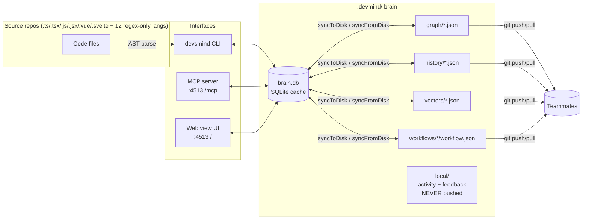

**Areas covered in this doc:**

| # | Area | Verified | Automated coverage | Primary interface |
|---|------|:---:|---|-------------------|
| A | Setup & Onboarding | [ ] | Partial — placement + gitignore tested; the `init` wizard is not | CLI (interactive) |
| B | Indexing (first build) | [ ] | Partial — AST/staging/edges tested; live LLM providers are not | MCP + CLI |
| C | Incremental Re-indexing | [ ] | Partial | CLI |
| D | Description & Embedding backfill | [ ] | Partial — `llm-client` tested; ONNX path is not | CLI + MCP |
| E | Search (multi-modal, 4 layers) | [ ] | Good — `tests/db/search.test.ts` | MCP |
| F | Graph Read / Navigation | [ ] | Good | MCP |
| G | Working Edit Flow (graph add) | ✅ | Good | MCP |
| H | Graph Surgery / Correction | [ ] | Good | MCP |
| I | Graph Health / Maintenance | [ ] | Good — `tests/db/analyze.test.ts` | CLI + MCP |
| J | Feedback Loop | [ ] | Good | MCP |
| K | History, Diff & Revert | [ ] | Good | CLI + Web |
| L | Activity / Session Tracking | [ ] | Good | MCP + CLI + Web |
| M | Workflows (feature memory) | [ ] | Good — rebuilt + 28 tests in 3.0.0 | MCP + CLI |
| N | Visualization | [ ] | Thin — HTTP routes only, no browser tests | CLI + Web |
| O | Sync & Persistence + AST core | [ ] | Good | cross-cutting |

> Tick a row once every item in that area's own **✅ Verify during testing** checklist passes. The **Automated coverage** column says what a test already proves, so a manual pass can focus on what it can't: real LLM providers, a real browser, and a real IDE reading a config DevsMind wrote.

---

## A. Setup & Onboarding

**What it does:** Bootstraps a `.devmind` brain, registers repos, wires the AI tool (rule + MCP server + memory + skill file).

**CLI:** `init`, `rule`, `mcp`, `memory`, `skill`
**Files:** `cli/init.ts`, `cli/rule.ts`, `cli/integrations/{mcp,memory,memory-topics,skill,prompt,registry}.ts`, `utils/config.ts`, `mcp/server.ts` (the `prompts` capability)

**Detailed flow:**
1. **`init`** (TTY-required). Detects git identity (`git config user.name/email`), tech stack (tsconfig→TS, package.json deps→frameworks). Chooses **embedded** (brain lives inside project, repo via `relative_path`) or **standalone** (own folder, repos via `.env` `REPO_<NAME>` keys). Interactive file include/exclude browser; offers to import the repo's `.gitignore`, but only **literal path-segment lines** (`isLiteralIgnorePattern`) — glob/negation lines (`*.log`, `!keep.log`) are skipped with a printed count, since the scan-time matcher (`scanner.ts`) has no glob engine and would otherwise silently no-op on them. Writes `config.json` (committable), `.env` (gitignored), `.gitignore`, creates `graph/` + `history/` with `.gitkeep`, initializes `brain.db`. `handleExistingInit` repairs an existing brain (developer info, repo paths, and the gitignore).
   - **`ensureDevmindGitignore`** (exported, 15 tests) creates `.devmind/.gitignore` or tops up a stale one with `.env`, `brain.db` + `-journal`/`-wal`/`-shm`, both scratchpads, and `local/`. Two 3.0.0 fixes: entries are compared by **what git reads them as** (`local`, `/local`, `local/`, `/local/` are one entry — raw string equality used to append a duplicate on every re-init), and the file is **appended to, never rewritten** (it used to drop every blank line, silently reflowing a gitignore someone had grouped and commented). `activity.ts`'s `ensureGitignored` self-heal — the backstop for a brain nobody ever re-inits — shares the same `normalizeIgnoreEntry`, so the two can't disagree about whether something is already covered.
2. **`rule`** builds a markdown workspace rule (tool-trigger table + protocol) and merges it into the target tool's rule file (Cursor `.cursor/rules/devsmind.mdc`, Copilot `.github/copilot-instructions.md`, Claude `CLAUDE.md`, Codex `AGENTS.md`, etc.). Two styles: **automatic** (AI stages/commits unasked) vs **manual**. `--print` / non-TTY prints instead of placing. `tests/cli/rule-memory-sync.test.ts` reads the live tool list off a real in-process MCP server and **fails on drift**, which is what keeps the rule from advertising a tool that no longer exists.
3. **`mcp`** merges an MCP server entry (stdio `{command:'devsmind', args:['start','--stdio', ...]}` or HTTP `http://localhost:4513/mcp`) into the tool's config (JSON, or TOML for Codex), non-clobbering. The stdio entry's `--path` is scope-conditional as of **4.0.1**: a **project**-scoped config bakes in the **absolute `--path`**, since that file lives inside — and only ever serves — the one project it was written for. A **global** config omits `--path` entirely, because it's ONE file shared by every project on the machine; baking one project's path into it used to silently point every other project at that same brain. Global instead relies on `bindServerToProject`'s own cwd auto-detect (walks up from wherever the process was launched looking for `.devmind`) — correct as long as the IDE spawns the server from the open workspace, which is the common case. `devsmind mcp` prints what this implies right after global is picked, and the server itself now logs where it looked and what it bound to (stderr, so it's safe under stdio) — see CHANGELOG 4.0.1.
4. **`memory`** writes nothing, for any tool — **print-only since 4.0.0**, now **conditional as of this release.** `registry.ts`'s `IdeTarget.memory.hasRealMechanism` (a rename of the previously-dead `memory.supported`) splits the 9 targets: **5** (claude-code, cursor, vscode, windsurf, qwen) have a genuine background-memory concept, so `handleMemory` calls `renderMemoryPrompt(target)` — ONE natural-language block framed as an explicit "remember this" request, meant to be pasted into any AI chat, with `DEVSMIND_INSTRUCTIONS` appended verbatim and a tool-specific `askHint` line spliced into the lead-in (e.g. Cursor's tells the agent to explicitly *propose* the memory, since it only saves after human approval). **4** (antigravity, antigravity-cli, codex, kiro) have no real background-memory mechanism at all, so `handleMemory` skips the prompt entirely and prints a short explanation pointing at `devsmind skill` instead — asking those to "remember" has nothing to attach to. This replaced writing per-tool memory/skills files: research across all 9 integrated tools found background/automatic memory to be discretionary by design almost everywhere (several tools say so in their own docs), while an explicit in-chat request is what actually gets saved reliably.
5. **`skill`** — **new this release.** Writes ONE file, `.agents/skills/devsmind/SKILL.md`, holding the full workflow contract (`renderCombined`, `integrations/memory-topics.ts` — same renderer, same content as topic 4's contract) as an explicitly-invokable command (`/devsmind`, or `$devsmind` for Codex) rather than something a tool decides on its own whether to recall. Revives `AGENTS_SKILL_SCOPE`/`skillMdWrap` (`registry.ts`) and `mergeRuleFile`'s `standalone` write path (`prompt.ts`), both previously dead since `memory` went print-only. One file, one location — no per-tool variants, no picker. Confirmed discoverable today by Antigravity, Antigravity CLI, and Codex; Claude Code/Cursor are documented to read the same `.agents/skills/` convention and may pick it up too.

**Also new this release, no CLI surface at all:** the MCP server now declares the **`prompts`** capability (`mcp/server.ts`) — `prompts/list`/`prompts/get` answer with one static prompt, `devsmind-workflow`, whose text is the same `DEVSMIND_INSTRUCTIONS` sent automatically at connect. Live for free the moment a client that supports it (Claude Code, Cursor, Windsurf, Kiro, Qwen so far) connects via the existing `mcp` command — no registry entry, no new file.

**Placement machinery (shared by 2, 3, 5 — `mcp`/`rule`/`skill`), `integrations/prompt.ts` + `registry.ts`:** `pickTarget`/`pickTransport`/`pick*Scope`/`pickMode` drive the menus; `pickDirectory` is the navigator that turns a menu into an absolute path; `mergeRuleFile`/`mergeMcpConfig` compute new file contents; `writeConfigFile` writes them. `skill.ts` reuses `mergeRuleFile`'s `standalone` branch directly — no new write primitive. This is the code that edits files the **developer** owns, where a bug doesn't fail — it mangles a config and looks like success. It had **no tests at all** before 3.0.0 and one such bug had shipped (see the TOML note below). Both files are now in the coverage gate at 100% lines and branches.

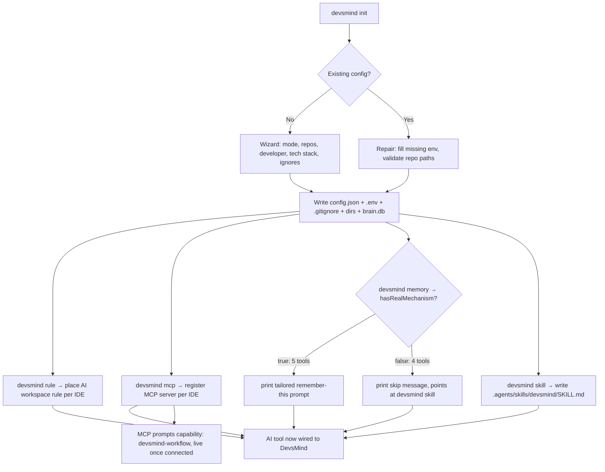

**✅ Verify during testing** — the wizard itself is the one part of this area with no automated coverage, so it needs a human:
- [ ] `init` embedded mode on a real project — paths resolve, brain.db created.
- [ ] `init` standalone mode — multiple repos via `.env` keys resolve.
- [ ] `init` on existing `.devmind` repairs without clobbering unrelated `.env` keys.
- [ ] The interactive include/exclude file browser reflects what actually gets indexed afterwards.
- [ ] Ignoring a folder like `out`/`dist`/a custom name does **not** also swallow a same-prefixed sibling (`outbound`, `distributors`, `legacy-utils`) — `shouldIgnorePath` matches full path segments only (regression-tested in `tests/utils/scanner.test.ts`).
- [ ] A `.gitignore` with wildcard/negation lines (`*.log`, `!keep.log`) prints how many were skipped instead of silently importing dead patterns.
- [ ] A leading-slash `.gitignore` entry (`/dist`, `/build`) is honored — it used to match nothing at all, in both the search walk and the indexer.
- [ ] Non-TTY `init` fails with a clear message (it can't prompt); non-TTY `rule`/`skill` **print** rather than fail; `memory` always prints (a tailored prompt or a skip message) regardless of TTY, since there is never anything to place.

*Covered by tests — re-verify only if something looks wrong:*
- [x] `.devmind/.gitignore` created fresh, topped up when stale, no-op on re-run, no duplicates across slash variants, user's comments/blank lines preserved (`tests/cli/init.gitignore.test.ts`, 15 tests).
- [x] Everything local (`.env`, `brain.db*`, scratchpads, `local/`) is ignored and everything shared (`config.json`, `graph/`, `history/`, `vectors/`, `workflows/`) is not.
- [x] `rule` output matches the live tool list — the drift gate fails otherwise (`rule-memory-sync.test.ts`).
- [x] `rule` places correctly for **all 9** targets, and a `wrap` (Cursor `.mdc`, Antigravity Skills) produces valid frontmatter (`placement.test.ts` integration pass).
- [x] `mcp` stdio and HTTP both merge for all 9 targets × every scope, without clobbering other servers, in JSON **and** Codex TOML.
- [x] Malformed JSON config → clear error, original left untouched. Corrupt DevsMind rule block → refuses to write rather than stacking a second block.
- [x] `memory --print` prints a tailored "remember this" prompt for the 5 tools with a real memory mechanism (claude-code, cursor, vscode, windsurf, qwen — same contract, different `askHint` lead-in) and a skip message pointing at `devsmind skill` for the 4 without one (antigravity, antigravity-cli, codex, kiro); unknown `--tool` explains what is valid (`memory-print.test.ts`).
- [x] `skill --print` prints the resolved path (`.agents/skills/devsmind/SKILL.md`) and the same content `renderCombined()` produces, without writing; interactive mode previews then confirms before writing (`skill.test.ts`).
- [x] MCP `prompts/list` returns exactly one `devsmind-workflow` prompt; `prompts/get` returns it as a `user`-role message whose text equals the live `DEVSMIND_INSTRUCTIONS`; an unknown prompt name rejects (`tests/mcp/prompts.test.ts`).
- [x] The pickers, including `pickDirectory` — typed paths, `~` expansion, a mistyped path being *refused*, the filesystem root, unreadable folders, anti-hang guards (`prompts.test.ts`, 41 tests).

**⚠️ Fixed in 3.0.0 — worth a manual re-check on your own Codex config:** `devsmind mcp` could corrupt an existing `~/.codex/config.toml`. Whether our table already existed was decided by a substring test over the whole file, then located by an exact line match — two different questions. A config merely *mentioning* `[mcp_servers.devsmind]` in a comment or a string passed the first and failed the second, so the index stayed `-1`, the file's last line was dropped, and every table after the mention was emitted **twice**. Duplicate tables are a TOML parse error, so the merge returned a config Codex could no longer read — while printing success.

---

## B. Indexing (first-time graph build)

**What it does:** Extracts every code entity into nodes and resolves connections. Two paths: **agent-driven** (MCP tools) and **local-LLM background** (CLI).

**MCP tools:** `index_start`, `index_checkpoint`, `index_continue`, `index_complete` — **rebuilt in 4.0.0**: the server extracts structure itself, locally and deterministically (`db/index-build.ts`, reusing `enumerateFileCandidates`); the AI's only job is writing descriptions via the existing `add_description` tool. No code crosses back to the server, and this flow doesn't touch `stage_change`/`edit_node` or the staging buffer at all — nodes are written directly, same as the CLI path below.
**CLI:** `index` / `index --run` / `index --run --describe`
**Files:** `cli/runner.ts`, `cli/extract-agent.ts`, `cli/llm-client.ts`, `cli/describe.ts` (`describePendingNodes`), `db/indexer.ts`, `db/staging.ts`, `db/edges.ts`, `utils/ast.ts`, `utils/scanner.ts`

**Key design points (verify these hold):**
- **Node extraction is deterministic-first:** `enumerateFileCandidates()` (AST) finds every declaration; **exported** symbols auto-accept with **zero LLM turns**; only **ambiguous non-exported** symbols go to the curation agent (`curateAmbiguousCandidates`, keep/drop/merge/rename, defaults to *keep*).
- **Edges are resolved 100% locally via AST** (`resolveConnectionsLocally`) — **no LLM for connections ever**. `--chunk-size`/`--chunk-overlap`/`--local-edges` are accepted but **no-ops** (legacy).
- **Descriptions are NOT written during CLI Phase 1/2 at all.** `upsertNode` in `runBackgroundIndexing`/`runBackgroundReindexing` never passes a `description` — every node this path creates starts out exactly like a pre-description-requirement backlog node (`description IS NULL`). The **agent-driven** MCP path is now the same shape: extraction (`index_start`/`index_continue`) never writes a description either — the calling AI supplies one afterward via `add_description`, one batch at a time.
- **Phase 3 (description backfill) is MANDATORY on a full run** (neither `--nodes-only` nor `--edges-only`) — it always runs after Phase 2, regardless of whether `--describe` was passed, reusing the SAME LLM credentials already resolved for extraction (`describePendingNodes`, shared with the standalone `devsmind describe` command — see area D). The reasoning: Phase 1/2 never write a description, so a "finished" full index without one isn't actually searchable via `search_nodes`' description-weighted BM25 field or its vector layer at all — only identifier/path/reasoning BM25 + grep would work.
- **On `--nodes-only`, Phase 3 stays OPTIONAL** — an additional extension gated by `--describe`, since `--nodes-only` exists specifically for a fast, structure-only partial pass; passing `--describe` alongside it backfills descriptions for just the nodes that run just extracted.
- **`--edges-only` is never eligible for Phase 3** — it resolves no credentials and creates no nodes (there's nothing new to describe). Combining `--describe` with `--edges-only` is rejected up front by the CLI.
- **Two phases (+ a 3rd that's conditionally required):** Phase 1 = nodes + code snapshots; Phase 2 = connection resolution + missing-node fill; Phase 3 = description backfill — mandatory on a full run, opt-in (`--describe`) on `--nodes-only`, never on `--edges-only`.

**Agent-driven flow (MCP), rebuilt in 4.0.0:**
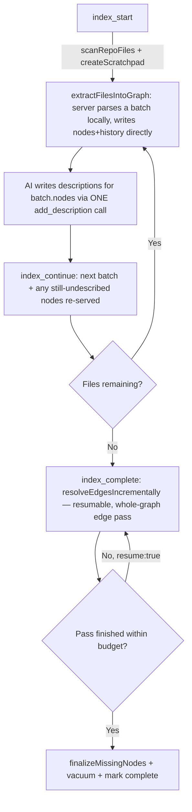
`index_checkpoint` is a zero-argument progress read now (files done/total, phase, described/undescribed counts) — the server owns progress, so there's nothing left for the AI to report.

**Local-LLM background flow (CLI `index --run`):**
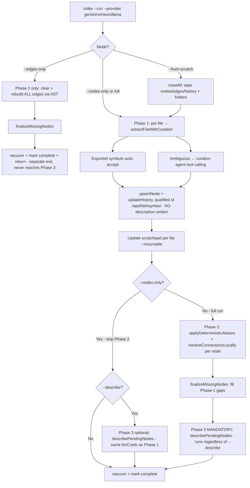

Note: `--describe` + `--edges-only` together is rejected up front by the CLI (area B's edges-only path never resolves credentials or creates nodes, so Phase 3 has nothing valid to run against) — the diagram's two top-level branches are mutually exclusive exits. On the full-run branch, Phase 3 is unconditional (`--describe` has no effect there — it's already mandatory); only the `--nodes-only` branch actually checks the flag.

**Providers:** Gemini (API key), Vertex (service-account JWT→OAuth, token cached 1h), Ollama (local). `--rpm` throttle shared across indexing+describe. `--repos` scopes standalone runs (separate scratchpad). Phase 3 shares the same provider/credentials as Phase 1 — no separate `devsmind describe` invocation needed, whether it ran because it's mandatory (full run) or because `--describe` was passed (`--nodes-only`).

**✅ Verify during testing:**
- [ ] Agent-driven full index on a fresh repo produces nodes with correct qualified IDs (`{repo}/rel/path#Symbol`).
- [ ] `index --run` gemini, vertex, and ollama each complete a full index.
- [ ] Exported symbols get extracted **without** an LLM turn (check curation only fires on ambiguous ones).
- [ ] Phase 2 edges match reality (spot-check callers→callees, incl. cross-file imports).
- [ ] `--from-scratch` wipes cleanly and reindexes; confirmation prompt works; `--yes` skips it.
- [ ] `--nodes-only` then `--edges-only` in sequence yields same graph as a full run.
- [ ] `--repos harrir-web` restricts correctly and does **not** mark the global session complete.
- [ ] Interrupt mid-run → resumes from scratchpad (no duplicate nodes).
- [ ] `--rpm 30` actually paces requests (no 429s on Gemini).
- [ ] RTK Query endpoints get nodes + generated-hook aliases (see area O).
- [ ] Missing-node fill: a used-but-unextracted symbol becomes a node in Phase 2.
- [ ] A plain full `index --run` (no `--describe` passed) still runs Phase 3 and leaves no node with a NULL description — Phase 3 is mandatory there, not opt-in; passing `--describe` on a full run is accepted but has no additional effect.
- [ ] `index --run --nodes-only` **without** `--describe` leaves every node's `description` NULL (confirm via `list_nodes` / DB) — expected, since Phase 3 is optional there.
- [ ] `index --run --nodes-only --describe` runs Phase 3 right after Phase 1 (no Phase 2 in between), using the same `--provider`/`--key`; summary line reports described/pending/failed counts.
- [ ] `--describe --edges-only` together is rejected with a clear error (edges-only never resolves credentials or creates nodes).
- [ ] `--repos` scoping composes correctly with a full run's mandatory Phase 3 and with `--nodes-only --describe`.

---

## C. Incremental Re-indexing

**What it does:** Keeps the graph in sync with manual code edits without a full rebuild.

**CLI:** `reindex`, `reindex --fill-gaps`
**Files:** `cli/runner.ts` (`runBackgroundReindexing`), `utils/ast.ts`, `db/edges.ts`

**Detailed flow:**
- **Default:** selects files with `mtimeMs > last_reindex_at`. Per file: capture inbound-edge sources → `deprecateNode` old nodes for that path → re-extract via `extractFileWithCuration` → upsert new nodes+history. **Phase 2** resolves edges for new/updated nodes, plus **Phase 2b** re-resolves the inbound callers whose edges were dropped by the deprecate (so "used-by" edges aren't silently stripped).
- **`--fill-gaps`:** selects files with **zero** nodes (never-indexed or dropped by a crashed run). Per-file failures are non-fatal (collected + skipped). Does a full graph-wide edge rebuild afterward. Safe to re-run until no gaps remain.

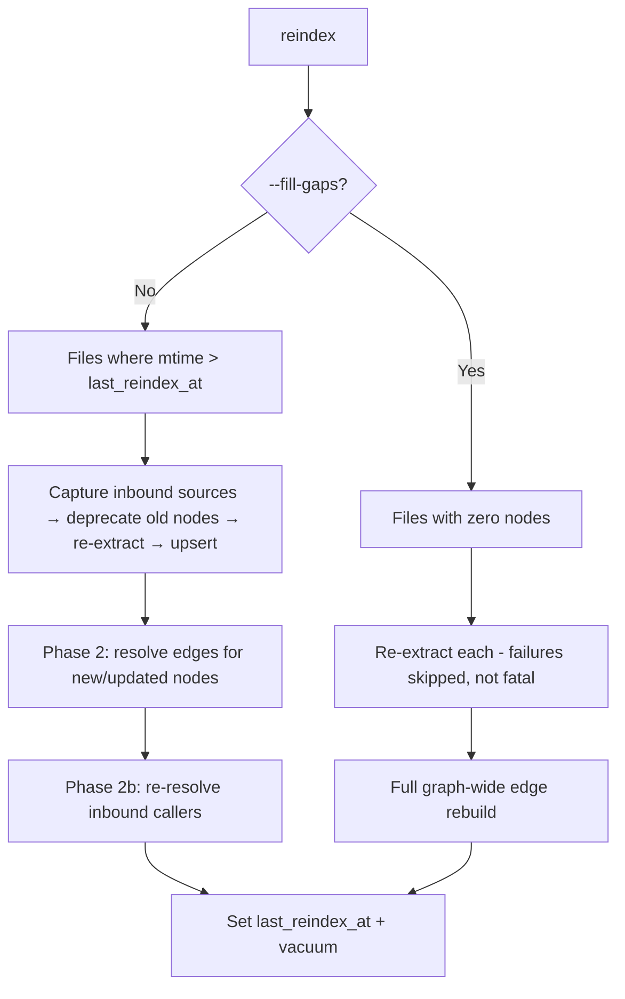

**✅ Verify during testing:**
- [ ] Edit one function → `reindex` updates only that file's nodes, edges intact.
- [ ] Rename a symbol → old node deprecated, new node created, inbound "used-by" edges preserved (Phase 2b).
- [ ] Add a new file → `reindex` picks it up.
- [ ] `--fill-gaps` after a crashed index fills the holes; re-running reports "no gaps".
- [ ] A syntactically broken file during `--fill-gaps` is skipped, not fatal.

---

## D. Description & Embedding Backfill

**What it does:** Ensures every node has a natural-language **description** (drives semantic search) and a **vector**. New nodes get these inline at commit; these commands clear an existing backlog.

**CLI:** `describe` (LLM), `embed` (local, no LLM)
**MCP:** `add_description`
**Files:** `cli/describe.ts` (`describePendingNodes` — the reusable core), `cli/embed.ts`, `db/embedder.ts`, `db/database.ts`

**Detailed flow:**
- **`describe`** — thin CLI wrapper: resolves credentials from `--provider`/`--key` (or handles `--dry-run`, which needs none), then delegates to `describePendingNodes(db, creds, opts)`. That shared function IS the work queue + batching + LLM + validate + embed loop below — it's also called directly, with credentials already resolved for extraction, by `devsmind index --run --describe`'s Phase 3 (see area B). Work queue = nodes where `description IS NULL`. Batches (default 25): builds a prompt from each node's latest code snapshot, calls the LLM (fixed system prompt demanding 1–3 searchable sentences, rejects name-restatements), `validateDescription`-checks, `upsertNode`s. If ONNX embedder available, also embeds the batch. Idempotent either way it's invoked.
- **`embed`** — fully local ONNX (`all-MiniLM-L6-v2` int8), no LLM/credentials. Work queue = described nodes missing/stale/wrong-model vectors. `--force` re-embeds all (model upgrade). Errors clearly if `onnxruntime-node` absent.

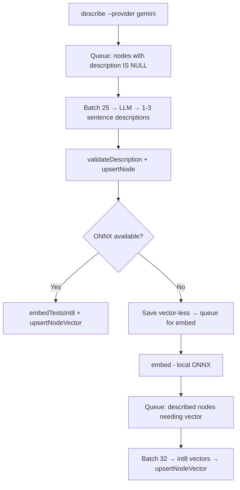

**✅ Verify during testing:**
- [x] `describe --dry-run` lists pending nodes with no credentials.
- [x] `describe` fills descriptions; re-running is a no-op (idempotent).
- [x] Descriptions that just restate the name are rejected (`validateDescription`).
- [ ] `embed` computes vectors offline with no API key.
- [ ] `embed --force` re-embeds after a model change.
- [ ] With `onnxruntime-node` absent: `describe` still saves descriptions; `embed` errors clearly; search falls back to BM25.
- [ ] `describePendingNodes`'s shared core behaves identically whether called from standalone `devsmind describe` or from `index --run --describe`'s Phase 3 (same batching/validation/embedding, just different credential source).

---

## E. Search (multi-modal — 4 result layers, not 3)

**What it does:** The core retrieval. One tool, but it actually returns results tagged from **four distinct layers** (`matched_via: identifier | fuzzy | semantic | code`, plus an always-separate `files` bucket). Two independent inputs drive it — `query` (natural language) and `pattern` (a real regex, replacing the old escaped/split `keywords` list) — either or both, at least one required. Verified against source: `db/database.ts` line references below.

**MCP tools:** `search_nodes` — the only one. `search_decisions` is gone (reasoning text from *every* history revision is already in `search_nodes`' BM25 field, so a decisions-only search was a subset pretending to be a feature) and `get_orphaned_nodes` is gone (`analyze_graph` reports orphans alongside every other check).
**Files:** `db/database.ts` (`searchNodes`, `tokenSearchNodes`, `vectorSearchNodes`, `mapGrepHitsToNodes`, `resolveSearchScopePath`, `computeSymbolSpans`, `annotateSampleLinesWithSymbol`), `db/embedder.ts`, `db/search-index.ts` (`scoreCandidate`, `reciprocalRankFusion`), `db/grep.ts` (`grepRepos`, `rankGrepHits`, `escapeRegExp`), `utils/tokenize.ts`

**How `search_nodes` actually works (corrected):**
1. **`pattern` is a REAL regex**, used exactly as given — not split on a delimiter, not escaped. When absent, one is derived by escaping and OR-joining `query`'s own significant tokens (the old fallback shape, just built from a real regex now). This is the ONE layer that always runs, regardless of `query`.
2. **Meaning-driven layers are gated on `hasQuery`** — a bare `pattern` has no meaning to tokenize or embed, so without a `query`, BM25, the vector layer, AND the identifier short-circuit are all skipped entirely (`searchNodes`, `database.ts:1514`). This is also a correctness guard, not just a mode choice: the identifier short-circuit's `LIKE '%'||query||'%'` would otherwise become `%%` on an absent query and wrongly match every node.
3. **Identifier short-circuit** (inside `searchNodes`, gated `if (hasQuery)`) — a `LIKE` wildcard over `name`/`id` only (NOT description/reasoning — that was a since-fixed bug: a natural-language substring hit used to be wrongly treated as an exact identifier match). If it finds **≤10** hits, they're returned immediately as `matched_via:'identifier'`, skipping BM25/vector below; grep still runs using `pattern` (or the query-derived fallback) either way, so the `files` bucket is never emptied by taking this path.
4. **BM25 full-text — `tokenSearchNodes`** (`database.ts:1742`, scoring in `search-index.ts:70-79`) runs next, over the `node_tokens` index (identifier/path/description/reasoning weighted fields, coverage gate, `MIN_BM25_SCORE=0.75`). Synchronous, runs before the `Promise.all` below. Tagged `matched_via:'fuzzy'` — a legacy label; it's BM25 ranking, not true fuzzy/edit-distance matching.
5. **Then, concurrently via `Promise.all`:** **semantic vectors — `vectorSearchNodes`** (embeds `query`, cosine-scans `node_vectors`, floor `0.35`, top 50, no-ops if ONNX absent OR `query` absent, tagged `matched_via:'semantic'`) and **filesystem grep — `grepRepos`** (`grep.ts`, one synchronous regex walk of every repo — or just `path`, if the caller scoped it — deadline-bounded, not DB-indexed at all).
6. **Grep's single raw hit list feeds TWO independent, parallel consumers — not a pipeline:**
   - `rankGrepHits` (`grep.ts`) → the **files** bucket: `RankedFile[]` — `file_path`, `total_matches`, **`match_counts`** (per-matched-string counts — renamed from `keyword_counts` now that a single regex has no fixed keyword list), `distinct_matches`, `score`, `sample_lines` (each optionally carrying `symbol`, the containing function/class — see `annotateSampleLinesWithSymbol`, `database.ts:1932`). `rankGrepHits` now also returns the TRUE `total` file count alongside the capped/paged `files` array — surfaced on the result as sibling `files_total`/`files_offset` fields (bucket itself stays a bare array).
   - `mapGrepHitsToNodes` (`database.ts:1858`) → a **third node ranking**, via AST line-span containment (resolves each hit line to the node whose span contains it, using the shared `computeSymbolSpans` helper at `database.ts:1909`; falls back to "every node in file" for non-AST-parseable languages). Tagged `matched_via:'code'`.
7. **Reciprocal Rank Fusion (RRF, k=60 — confirmed in `search-index.ts:95`)** fuses exactly **3 node rankings: fuzzy (BM25) + semantic (vector) + code (grep-mapped)**. **The files bucket is never part of this fusion** — it's a fully separate, always-present output. The TRUE count before the top-20 cap ships as `nodes_total`.
8. Each node result is annotated with `found_by` layers, confidence (high/med/low), 0–100 relevance, and drill-in hooks (uses/used_by/history_count/last_updated).
9. **`path` scoping** — `resolveSearchScopePath` (`database.ts:1831`) restricts the grep walk to one folder/file within a configured repo; rejects (throws) a path outside every repo rather than silently widening the search. The ignore list (`node_modules` et al.) still applies inside a scoped path — a scope pointing straight at an ignored dir returns nothing, not a bypass.

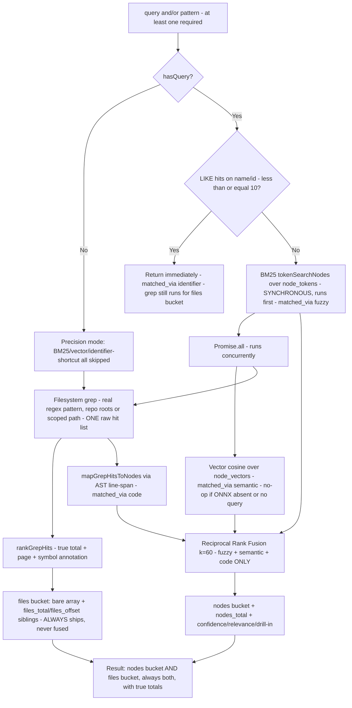

**✅ Verify during testing:**
- [ ] Exact/near-exact name query (≤10 LIKE hits on name/id) returns immediately as `matched_via:'identifier'`, skipping BM25/vector; grep still populates `files`.
- [ ] BM25 ("fuzzy") really does run before, not concurrently with, vector+grep — confirm via the code path, not just output correctness.
- [ ] Natural-language query ("where do we validate email") finds the right node via the **semantic** (vector) layer.
- [ ] A code pattern that only exists in a non-indexed or non-AST-parseable file surfaces via the **code** layer (`matched_via:'code'`) or the **files** bucket — not silently dropped.
- [ ] The **files** bucket (`file_path`, `total_matches`, `match_counts`, `sample_lines[].symbol`) always returns alongside `nodes`, even when fuzzy/semantic/code all found nothing. `files_total`/`nodes_total` are honest before any cap.
- [ ] A `pattern`-only call (no `query`) skips BM25/vector/identifier-shortcut and still returns code-match nodes + files.
- [ ] `pattern` is used AS-IS (not escaped) — e.g. `item\.liked` matches a literal `item.liked`, not a backslash.
- [ ] `path` scoping narrows the files bucket to one folder/file, and rejects a path outside every configured repo.
- [ ] `offset`/`limit` page the files bucket without repeating or skipping rows across calls.
- [ ] RRF fuses only fuzzy + semantic + code — confirm the files bucket's ranking is completely unaffected by RRF (it's a separate output, never fused).
- [ ] With ONNX absent: fuzzy (BM25) + files/code (grep) still work; semantic layer no-ops cleanly, no crash.
- [ ] Grep respects the deadline (no hang on huge repos); Windows performance acceptable on a large monorepo.
- [ ] `pattern`, `path`, `case_insensitive`, `offset`, `limit` params all behave (no more dead `is_regex`/`keywords`).
- [ ] A reasoning-text query still finds the node that recorded the decision — `search_decisions` is gone, and `search_nodes` searching **every** revision's reasoning is what replaces it.
- [ ] Orphans surface via `analyze_graph` now that `get_orphaned_nodes` is gone.

**Size discipline (3.0.0) — verify these, because the failure mode used to be a dead end:**
- [ ] An oversized result is trimmed rather than spilled-then-truncated, and `compacted` names what was dropped. **Every count stays exact**, so a trimmed result can never read as complete.
- [ ] `compact:false` returns the untrimmed payload; `compact:true` returns a lean triage list up front.
- [ ] Lockfiles (`package-lock.json`, `yarn.lock`, `go.sum`, …) and build artifacts (`*.min.js`, `*.map`) no longer appear. `.env`, JSON and config still do — that's what the `files` bucket is for.
- [ ] A `path` scoped straight at an excluded file returns nothing **and says so in `scope_note`**, rather than reading as "the pattern isn't in there".
- [ ] `limit:"abc"` no longer yields an empty `files` array next to a non-zero `files_total` (it became `NaN`, and `slice(0, NaN)` returned nothing — indistinguishable from "grep found nothing"); a negative `offset` no longer pages from the end.
- [ ] Your configured `ignored_paths` **files** actually disappear from results. They never did before — the list was only ever checked against directories, so every file in it was silently searched anyway.

---

## F. Graph Read / Navigation

**What it does:** Read nodes, live code, history, and dependency graphs.

**MCP tools:** `list_nodes`, `get_node_code`. **Two, not four** — `get_node_graph` and `get_node_history` became *parameters* on `get_node_code` in 3.0.0, because three round trips to answer "what is this, who calls it, and why does it look like this" was three round trips too many, and depth-1 neighbors were already free on every call.
**Files:** `db/database.ts` (`listNodes`, `countNodes`, `getLiveCode`, `getFullHistory`, `getGraph`), `utils/ast.ts` (`extractLiveCode`, `listFileImports`, `outlineFile`)

**Detail:**
- `get_node_code` **parses the symbol live from disk**, falling back to the cached snapshot when it can't be located (reported as `source:"cached"`). Always included at no extra cost: `name`/`type`/`signature`/`description`, the file's `imports`, up to 20 named callers **and** callees per direction (`uses_nodes`/`used_by_nodes`, counts true even when capped), up to 40 sibling declarations (`file_outline`), and the last 3 changes' reasoning (`recent_history`). A raw file read should not be needed after this for any of those.
- `graph_depth` + `graph_direction` walk the transitive graph past those neighbors, in the same call. Node cap **120**; the walk is now **deterministic**, so two identical calls return identical results. `graph_code:true` attaches live source within `graph_code_budget` — **default 24000** when embedded in a `get_node_code` response (was 60000), since it rides along with code, imports, neighbors and history rather than being the whole payload.
- When the budget runs out, the dropped nodes are named **by id** in `graph.code_omitted_node_ids` — not a positional cursor, because the walk is re-derived per call and the cut-off also depends on file contents, so an index would silently skip or repeat. Nodes whose source genuinely can't be found are counted separately as `graph.nodes_no_code_available`; raising the budget will never bring those back. The root's code is no longer duplicated inside the graph.
- `history:"full"` returns every revision with diffable before/after edits, pageable via `history_limit`/`history_offset`.
- `list_nodes` is **paged**: `{nodes, total, offset}` with `total` as the true match count, `limit` default 100 / max 500, plus `truncated` and a `hint` naming the next call. It previously had no bound of any kind — one unfiltered call on a real backend returned ~600KB across ~10,900 lines, past the client's inline limit. Ordered by file path then name so pages never overlap or skip. **Breaking:** the response is an object, not a bare array.

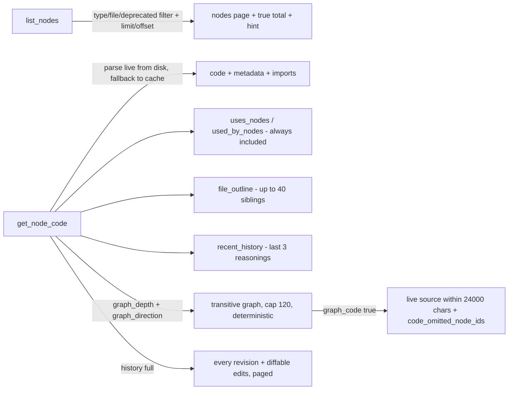

**✅ Verify during testing:**
- [ ] `list_nodes` filters by type / file_path / include_deprecated, and **pages**: `total` is the true count, `hint` names the exact next call, consecutive pages never overlap or skip.
- [ ] An unfiltered `list_nodes` on your largest repo returns in one readable page instead of blowing the client's inline limit.
- [ ] `get_node_code` on a real function returns imports, callers, callees and the file outline — then confirm you did **not** need to open the file afterwards. That is the actual claim being tested.
- [ ] `graph_direction:"in"` at depth 2–3 gives a blast radius that matches reality before a signature change.
- [ ] `graph_direction:"out"` + `graph_code:true` at depth 3 reads a whole request flow in ONE call.
- [ ] Budget exhaustion names the omitted nodes by id, and fetching exactly those completes the picture.
- [ ] `nodes_no_code_available` is reported separately from budget omissions — raising the budget must not change it.
- [ ] Two identical `graph_code` calls return identical output (deterministic walk).
- [ ] `graph_code_budget:"abc"` is clamped rather than becoming an **unlimited** budget (it did: every `spent + len > NaN` is false).
- [ ] `history:"full"` returns the full chain with reasoning; `history_limit`/`history_offset` page it.
- [ ] Calling the retired `get_node_graph`/`get_node_history` by name still answers (unadvertised back-compat) rather than hard-failing an agent on an old rule.

---

## G. Working Edit Flow (graph add / commit)

**What it does:** The primary write path — how the AI edits code and records it into the graph.

**MCP tools:** `edit_node`, `stage_change`, `add_description`, `commit_changes` (+ hidden legacy `add_node`, `add_connection`, `update_history`) — `edit_node` is the write path to use for every edit (TS/JS only, per the README). `stage_change` (**removed in 4.0.0, reinstated after with different semantics**) is not a second way to make an edit: it recovers one made WITHOUT `edit_node` — same `file_path`/`old_string`/`new_string` shape, but `new_string` is located on disk rather than written, since the caller's own edit/write tool already put it there. Both feed the same `findTouchedSymbols` → staging → `commit_changes` path. **`commit_changes` never touches git** — no shell-out, no git command anywhere in `commitStagedChanges`/the MCP handler — it writes only into `.devmind/`'s own graph/database and activity log; a real `git commit` is a fully separate, human-initiated step (see CHANGELOG 4.1.0 for the instruction-clarity fix after an agent was observed running one unprompted).
**Files:** `db/staging.ts`, `db/database.ts`, `utils/edit.ts`, `utils/ast.ts` (`findTouchedSymbols`), `db/activity.ts`, `db/feedback.ts`

**Detailed flow:**
1. **`edit_node`** — the write path to use for **any** file. Path-guarded (`isPathAllowed`). `old_string:""` creates a new file; else exact-match `replaceTextInFile` (CRLF/LF tolerant, `replace_all` supported). **Writes source to disk immediately.** Then traces which symbols the write touched (`findTouchedSymbols`, by span not name) and stages each with `code_before`/`code_snapshot`. If no symbol traced (CSS/JSON/import line), stages a **whole-file edit** for the activity log. Returns a unified diff + callers/callees.
1b. **`stage_change`** — recovers an edit made WITHOUT `edit_node` (the AI's own editor tool, or work from before this session). Same params, roles reversed: `new_string` must already be found on disk (`locateAppliedEdit`, the read-only mirror of `replaceTextInFile`) — **nothing is written**, `old_string` only reconstructs the pre-edit content for history/diffing. From there it's identical to `edit_node`: same `findTouchedSymbols`, same staging, same whole-file fallback, same diff + callers/callees response shape.
2. **`commit_changes`** — atomically flushes the buffer: upsert nodes + write history (shared reasoning) + batch-embed descriptions + resolve edges (clear-then-resolve). **Gates:** requires `message`, `reasoning` (what/why/goal), `feedback` (5 fields, "none" ok), and **refuses any new node without a description.** Side effects: records a workflow step if active, writes an activity-log message, routes feedback to graph/product logs.

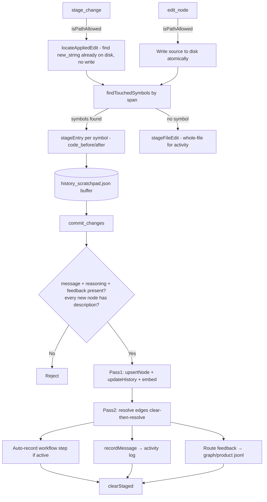

**✅ Verify during testing:**
- [x] `edit_node` edits a `.ts` function → disk changes, correct symbol staged, diff returned.
- [x] `edit_node` with `old_string:""` creates a new file (+ parent dirs).
- [x] `edit_node` on a `.css`/`.json` file → whole-file edit staged (no node), still in activity log.
- [x] `edit_node` outside configured repos is **rejected** (`isPathAllowed`).
- [x] CRLF vs LF file: exact-match still succeeds (EOL-tolerant).
- [x] `replace_all` replaces every occurrence; single-match required otherwise.
- [x] `stage_change` traces + stages an edit already on disk without writing to the file (`tests/mcp/tools.test.ts`, `tests/utils/edit.test.ts`).
- [x] `stage_change` on `old_string:""` stages an already-created file as new, without writing it.
- [x] `stage_change` errors when the file doesn't exist yet, or when `new_string` isn't found on disk — points at `edit_node` for the first case.
- [x] `stage_change` rejects a path outside configured repos and requires `session_id`, same as `edit_node`.
- [x] A `stage_change`-staged entry commits through `commit_changes` exactly like an `edit_node`-staged one.
- [x] `commit_changes` **rejects** when a new node lacks a description.
- [x] `commit_changes` rejects missing message/reasoning/feedback.
- [x] After commit: edges resolved, activity message written, workflow step recorded (if active).
- [ ] 1-hour session rule: two quick edits to same node collapse into one history entry (see K).

---

## H. Graph Surgery / Correction

**What it does:** Batch, evidence-gated corrections to a graph that came out wrong — the "graph-fix session" tools. Additive/reversible by design.

**MCP tools:** `rename_node`, `deprecate_node`, `merge_nodes`, `split_node`, `create_missing_node`, `link_nodes`, `record_alias`
**Files:** `db/database.ts` (`renameNode`, `deprecateNode`, `mergeNodes`), `db/edges.ts` (`splitNode`), `utils/ast.ts` (`extractNodeFromFile`)

**Detail:**
- `rename_node` — migrates connections + history + vectors to a new id (cascades on disk too).
- `deprecate_node` — soft-delete: drops connections/vectors, keeps history, rewrites caller files.
- `merge_nodes` — reassign edges/history/aliases from source→target, deprecate source (reversible).
- `split_node` — re-extract real symbols from the file via AST; deprecate original only if ≥1 split succeeds.
- `create_missing_node` — AST-extract a symbol (no LLM) → upsert + record "ast" reasoning.
- `link_nodes` / `record_alias` — **evidence-gated** (`verifyEvidence`: file must exist and still contain the snippet).

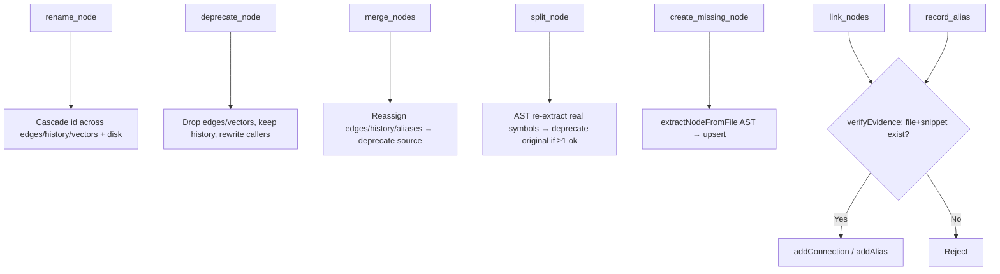

**✅ Verify during testing:**
- [ ] `rename_node` — inbound/outbound edges and history follow the new id; disk JSON patched; caller files rewritten.
- [x] `deprecate_node` — node hidden, history retained, callers updated.
- [ ] `merge_nodes` — target absorbs edges/history/aliases; source deprecated; reversible.
- [ ] `split_node` — a too-coarse node splits into real declarations; original deprecated only on success.
- [ ] `create_missing_node` — creates a node for a real symbol without LLM; refuses if not locatable.
- [ ] `link_nodes` / `record_alias` — **rejected** when evidence file/snippet doesn't exist.

---

## I. Graph Health / Maintenance

**What it does:** Zero-AI, zero-token health checks + safe auto-fixes, plus manual pruning.

**CLI:** `analyze`, `analyze --fix`, `prune`, `sync --analyze`
**MCP tools:** `analyze_graph`, `recheck_graph`
**Files:** `db/analyze.ts` (`runAnalysis`), `db/database.ts` (detectors), `cli/analyze.ts`, `cli/prune.ts`, `utils/git.ts`

**Detectors (all local SQLite/FS/git):** god entities (degree ≥15), circular dependencies (DFS), orphaned nodes, dangling edges, duplicate/case-collision IDs, history missing developer attribution, empty code snapshots, spurious/built-in-named nodes, nodes with missing files, git-detected renames, git-tracked files with zero nodes.

`findSpuriousAndMissingFileNodes`'s "missing files" check is `fs.statSync(p).isFile()` (was `fs.existsSync(p)`) — **fixed** after a production node was found with `file_path` pointing at a whole repo/workspace DIRECTORY rather than a real file: `existsSync` alone said that path "exists", so the node sailed through every analyze run indefinitely, and only ever surfaced as an EISDIR crash much later, when `writeGraphToDisk`/`writeVectorsToDisk` tried to write a JSON *file* at that same path during `devsmind sync` (see area O). `statSync().isFile()` catches "doesn't exist" and "exists but isn't a file" in the same check — `--fix` deprecates either the same way.

`--fix` applies **only safe/reversible** fixes: deprecate dead nodes, delete dangling edges, migrate renames. `recheck_graph` prunes spurious nodes with zero history. `prune` is an interactive manual reviewer.

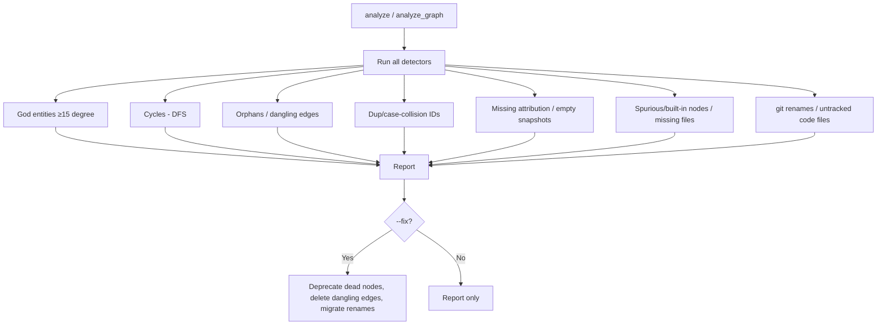

**✅ Verify during testing:**
- [ ] `analyze` on a real graph reports each category sensibly (no false god entities at threshold 15).
- [ ] `--god-entity-threshold` override works.
- [ ] `analyze --fix` only makes safe changes; nothing destructive.
- [ ] Rename detection via git migrates the node id correctly.
- [ ] `recheck_graph` removes primitives/built-ins (promise/map/data/res…) that have zero history.
- [ ] `prune` interactive flow inspects and removes nodes/history.
- [ ] `sync --analyze --fix` runs analyze on the freshly-synced DB.

---

## J. Feedback Loop

**What it does:** Captures graph problems and product feedback for a later supervised fix session. Never blocks the agent, never auto-applied.

**MCP tools:** `read_graph_feedback`, `mark_graph_feedback_processed`, `flag_indexer_rule`
**Files:** `db/feedback.ts`
**Fed by:** every `commit_changes` (feedback param) → `feedback_graph.jsonl` (machine-actionable) + `feedback_product.jsonl` (human) + `indexer_rule_candidates.jsonl`. All under gitignored `local/`.

**Detail:** `appendGraphFeedback` downgrades `confirmed`→`suspected` without evidence. `clusterGraphFeedback` groups by (node_id, category), sorts by frequency, highest-confidence wins. `flag_indexer_rule` logs a recurring pattern for a human to promote into a permanent detector.

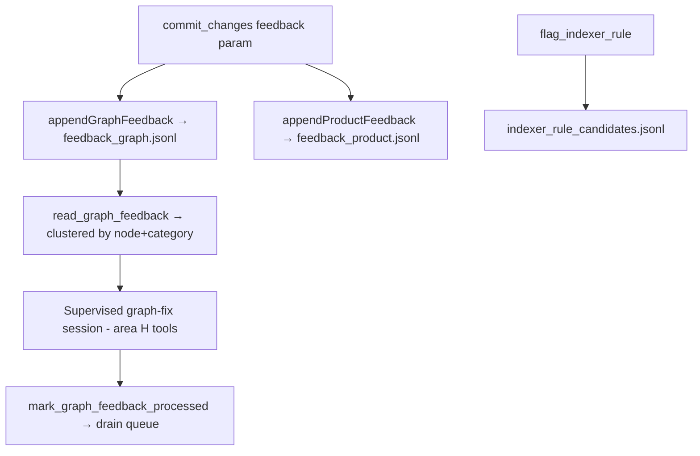

**✅ Verify during testing:**
- [ ] A `commit_changes` with a graph problem lands in `feedback_graph.jsonl`.
- [ ] Feedback without evidence is downgraded `confirmed`→`suspected`.
- [ ] `read_graph_feedback` returns unprocessed items clustered by node+category.
- [ ] `mark_graph_feedback_processed` drains them idempotently.
- [ ] `flag_indexer_rule` logs a candidate without changing the graph.
- [ ] Feedback files stay in `local/` and are gitignored (not pushed).

---

## K. History, Diff & Revert

**What it does:** Version history per node + multi-granularity revert.

**CLI:** `diff <node_id>`, `revert <node_id>`
**Web APIs:** `/api/node-diff`, `/api/revert`, `/api/message-revert`, `/api/message-file-revert`, `/api/message-edit-revert` (+ unrevert variants)
**Files:** `db/database.ts` (`updateHistory`, `eraseLastEdit`), `db/revert.ts`, `db/message-revert.ts`, `db/file-diff.ts`, `utils/diff.ts`

**Key rules:**
- **1-hour session-boundary:** edits <1h from the latest history row **update it in place** (append reasoning + edit trail) rather than creating a new row, which keeps history lean. Note the consequence, because it drove the 3.0.0 workflow rebuild: **a history row cannot identify a commit.** Two commits touching one node within the hour merge into a single row, so the old workflow-step `history_ids` could point at rows an earlier commit created, and one row could be cited by several steps. Steps record `node_ids` + their own copied `reasoning` now.
- **Only the newest edit is revertable**, and only if the live code still matches the recorded `after` (drift guard).
- **`devsmind revert` leaves no trace again.** A history row cited by a workflow step used to be *emptied* rather than deleted, so the step wasn't left pointing at nothing. Nothing references a history row any more, so the guard had nothing to check — `eraseLastEdit` deletes the row outright, and `history_ids` is gone from the types.
- **Message-level revert** is a stack model: reverting a message also reverts every later non-reverted message; un-revert enforces stack order.

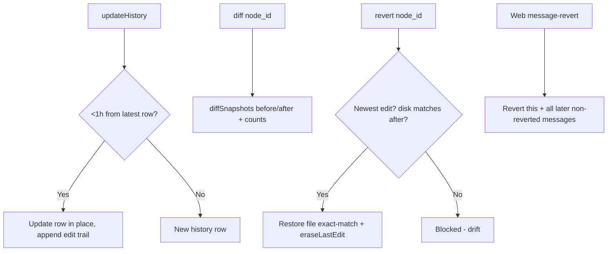

**✅ Verify during testing:**
- [ ] Two edits to same node within an hour = one history entry with two edits in the trail.
- [ ] Edits >1h apart = separate history rows.
- [ ] `devsmind revert` on a node whose commit also produced a workflow step **deletes** the history row (no emptied husk left behind) and leaves the step intact — the step cites nodes, not rows.
- [ ] `diff <node>` shows colorized +/- with correct counts.
- [ ] `revert <node>` restores file and erases the last edit; blocked with clear message on drift.
- [ ] `revert` only allows the newest edit.
- [ ] Web whole-message revert cascades to later messages; un-revert re-applies in stack order.
- [ ] Web file-level and edit-level revert/unrevert work independently.
- [ ] Reverting is blocked (not silently wrong) when the file changed since.

---

## L. Activity / Session Tracking

**What it does:** Local, per-developer, never-pushed timeline of sessions → messages → edits — plus a shared-history fallback so the same questions still answer on a machine that has no local log.

**MCP tools:** `start_session`, `get_activity_log`
**CLI:** `activity`, `activity --since <days>`
**Web:** `/api/activity` (Chat view)
**Files:** `db/activity.ts`, `db/activity-graph.ts`

**Detail:** All JSON under gitignored `local/` (self-heals `.gitignore` on first write — see area A), atomic writes, no SQLite. `start_session` mints a UUID; **every WRITE requires `session_id`** — reads do **not**, as of 3.0.0. Searching and reading mutate nothing, so gating them bought nothing but friction: the first thing an agent does in a conversation is usually a search, and it used to error. `get_activity_log`'s own optional `session_id` **filter** is also no longer force-promoted to required by the blanket injection it used to pass through. `recordMessage` (called by commit) records a commit's edits into a message, and also stamps `workflow_sync` bookkeeping so area M's sync won't re-propose work already recorded. `queryActivityLog` filters by developer/session/time-window/requirement-substring. `deriveStatus` = applied/partial/reverted (single source of truth so revert can't drift).

**The fallback (`db/activity-graph.ts`):** being gitignored is what makes the local log safe to hold verbatim requests and full before/after backups — and also what made it empty for a teammate on a fresh clone, who got nothing back even though `history/` had been recording all along. `get_activity_log`'s `source` param resolves that: `auto` (default) reads local and falls through to committed history only when local is empty; `both` merges the two for a team-wide view; `local`/`graph` force one. Graph entries are reconstructed by grouping history blocks on **reasoning text + a 60s cluster gap** — `commitStagedChanges` writes one identical reasoning block per node in a commit, while `session_id` is unusable as a key because the 1-hour merge reuses the row-creating session's id. The view is lossier by construction (no revert status, `request` degrades to the reasoning's Requirement, untraced whole-file edits absent), so every graph-backed response carries a `caveats` array. `both` de-dupes your own commits — which exist in both stores — on local session id **AND** developer, in that order of evidence: session alone would hide a teammate whose block the merge filed under your session, and showing a duplicate beats hiding someone's work.

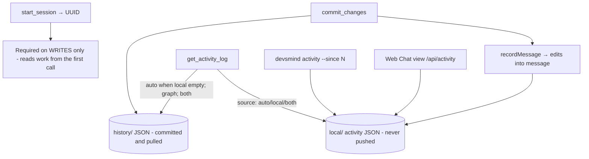

**✅ Verify during testing:**
- [x] `start_session` mints a session; a **write** without `session_id` errors.
- [ ] `search_nodes`/`get_node_code`/`list_nodes`/`get_activity_log` all work **before** `start_session` has ever run.
- [ ] `get_activity_log` with no `session_id` returns every session's activity, not just the current one.
- [ ] A commit records a message with per-edit before/after.
- [ ] `get_activity_log` filters by developer, sinceHours/since/until, requirement substring.
- [ ] `devsmind activity` groups by Today/Yesterday/date; `--since` filters.
- [ ] Activity data stays in `local/` and is never git-pushed.
- [ ] On a fresh clone with an empty `local/`, `get_activity_log` still answers — `source:"graph"`, `fell_back:true`, `caveats` present.
- [ ] `source:"both"` shows a teammate's commits alongside yours, with your own listed once, not twice.
- [ ] One commit touching several nodes comes back as ONE graph entry; two commits sharing reasoning text hours apart come back as two.
- [ ] Status (applied/partial/reverted) stays consistent after web reverts.

---

## M. Workflows (cross-session feature memory) — **rebuilt in 3.0.0**

**What it does:** A named, **backward-looking** log of how one piece of functionality grew, across many nodes and many sessions. You read it before touching something, to learn how it got this way. Not a plan, not a task list; nothing ever "completes". Full rationale: [WORKFLOW_DESIGN.md](WORKFLOW_DESIGN.md).

**MCP tools (8, down from 12):** `workflow_create`, `workflow_bind`, `workflow_list`, `workflow_get_context`, `workflow_add_step`, `workflow_sync`, `workflow_archive`, `workflow_import`
**CLI:** `workflow` (interactive: list, read a timeline, archive/unarchive), `workflow-import`
**Files:** `db/database.ts` (workflow ops), `db/workflow-import.ts`, `db/activity.ts` (`bindSessionWorkflow`/`readSessionWorkflow`/`lastBoundWorkflowId`)

**The bug this rebuild existed to fix.** "Which workflow is active" was a **single project-wide pointer** (`system_meta.active_workflow_id`), which was also serialized into the committed `workflow.json` and restored on sync. Two sessions shared it: session B calling `workflow_resume` silently paused session A's mid-work, and A's next `commit_changes` wrote its step onto **B's** timeline — no error. Because the pointer travelled through git, a teammate could do it to you from another machine.

**What replaced it:**
- **Binding is per session and local** (`.devmind/local/`, gitignored). It never moves, pauses, or steals anyone else's, and two sessions can work different workflows at once. There is no stored "active workflow" — "is this active" is just whether some session is bound, and "what was I last on" is *derived* (the newest session carrying a `workflow_id`), surfaced by `start_session` only when one exists.
- **Steps record `reasoning` + `node_ids`**, not `history_ids` (see area K for why a history row can't identify a commit). Reasoning is **copied** rather than joined, because history reasoning *mutates* afterwards — the hourly merge appends, a revert can drop a block — and a record of what we thought at the time can't read from a moving target.
- **`archived` replaces `status`.** Nothing ever completed and nobody marked it, so the field lied. Threads sort by last-touched; archiving claims only what it delivers — hide from the list, reversibly. `pending_tasks` is gone with no replacement: a stale "what's left" is worse than none, because an agent acts on it confidently.
- **Documents are `doc_paths`, not copies.** The old `workflow_add_artifact` duplicated whole files into `.devmind/workflows/<id>/artifacts/`; a copy goes stale the moment the original changes, and your repo already versions the original. A path outside every configured repo is rejected — a file only you can see is useless to a teammate.
- **`workflow_sync` actually reads something.** `workflow_sync_retroactive` read no activity log, no history, no transcript — the agent hand-assembled a `steps` array. The new one reads your local activity log, previews, and writes only on `confirm:true`. Dedupe is by **consumed edit id**, not a per-message flag: a message keeps growing after tagging, so a boolean would permanently strand everything added later.
- **`workflow_get_context` is paged and size-guarded** (it had *no* cap: every step, every artifact, optionally every artifact file inlined whole). `last_n` reads the tail; `steps_total` is always exact; oversized pages drop `reasoning` then `node_ids` with a `compacted` note. Document content is never inlined.
- **Cross-version safety via a sidecar.** Each workflow is two files: `workflow.json` in the shape a pre-3.0 client understands, plus `v2.json` holding what that shape has no field for (`archived`, per-step `reasoning`/`node_ids`/`doc_paths`). `devsmind sync` re-serializes `workflow.json` from local columns, so an un-upgraded teammate who pulled and synced *would* have rewritten it without the new fields and committed that loss — they have no idea the sidecar exists, so they can't touch it, and the next read merges everything back.
- **No drift detection, deliberately.** Asking an agent to notice "this isn't related anymore" gets it wrong in both directions. Retroactive fixing being cheap is what makes getting it wrong in the moment acceptable.

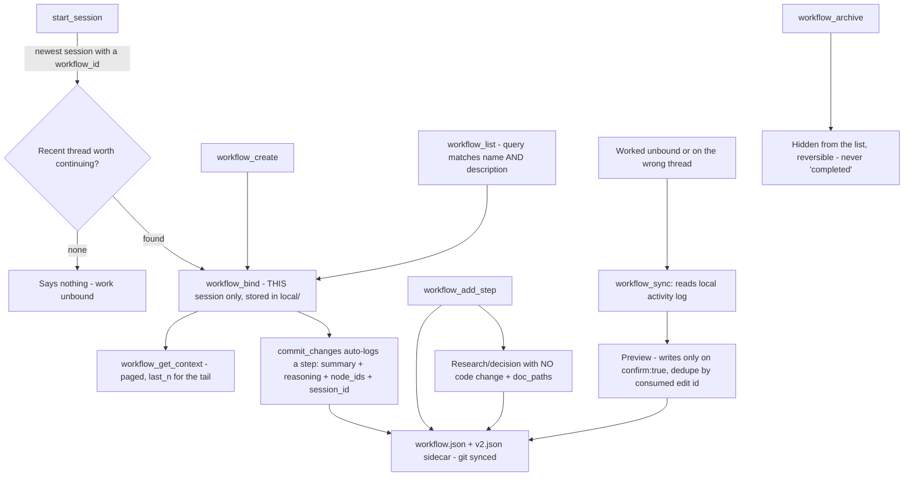

**✅ Verify during testing** — the regression at the top is the one that matters most:
- [ ] **Two sessions bound to different workflows do not interfere.** Bind A and B, commit from each, confirm neither step reaches the other's timeline. This is the bug the whole rebuild exists to fix.
- [ ] `start_session` offers a recent thread when one exists and **says nothing** when it doesn't (an ordinary session must see no friction).
- [ ] `workflow_bind` with no id unbinds; binding does not touch any other session.
- [ ] A commit while bound auto-records a step carrying `reasoning`, the right `node_ids`, **and a populated `session_id`** (that column existed and sat null on the path creating nearly every step).
- [ ] `workflow_add_step` records a research finding with **no** code change; `doc_paths` inside a repo is accepted and one outside every repo is rejected.
- [ ] `workflow_list` `query` finds a workflow **by its own name** — the old `workflow_search` scanned step summaries and artifact names but never `workflows.name`, so looking one up by name returned nothing.
- [ ] `workflow_get_context` `last_n`/`limit`/`offset` page correctly and `steps_total` stays exact.
- [ ] `workflow_sync` previews before writing, writes on `confirm:true`, and **re-running is a no-op**. Also: a commit already recorded by `commit_changes` is not re-proposed (an e2e run caught exactly that — only sync marked edits consumed).
- [ ] `workflow_archive` hides from the list and unarchive restores it.
- [ ] `workflow_import` imports a folder of `.md` docs, references the source **by path** rather than copying, and re-import updates in place.
- [ ] Workflows survive `git pull` + `devsmind sync`, with `archived` and per-step `reasoning`/`node_ids`/`doc_paths` intact.
- [ ] **Migration on a pre-3.0 brain:** new columns appear on first open, old steps backfill `node_ids` from resolvable `history_ids`, and steps whose rows no longer resolve degrade to summary-only rather than throwing. Backfill is **approximate** — the hourly history merge means an old step's node list can come out broader than what it really touched. Steps written from now on are exact.
- [ ] Retired names (`workflow_pause`/`workflow_resume`) still answer as bind/unbind aliases rather than hard-failing an agent on an old rule.

---

## N. Visualization

**What it does:** Offline browser UI — a **Chat view** (edit history + revert) and a **Graph view** (ego-graph 2D/3D).

**CLI:** `view`
**MCP tool:** `get_visualizer_url`
**Web:** served by the same Express server on `:4513` — `/`, `/app/:file`, `/vendor/:file`, `/api/graph-data`, `/api/activity`, diff + revert APIs
**Files:** `mcp/visualizer.ts`, `mcp/view.html`, `mcp/view.js`, `mcp/view_chat.js`, `mcp/view_graph.js`, `mcp/view.css`, `mcp/vendor/*`

**Detail:** No CDN, no build step — vendored `three.min.js`, `force-graph.min.js`, `3d-force-graph.min.js`. **Chat view:** `commit_changes` rendered as bubbles grouped by session, three-granularity revert (message/file/edit), side-by-side diff toggle, full-file panel. **Graph view:** repo→type accordion, search box, filters (type/developer/date, persisted per-brain), **ego-graph** on node click (uses / used-by, color-coded), 2D/3D toggle, whole-graph overlay, details pane with history + revert. Source-file-writing routes are CSRF-gated (`X-Devsmind-Token`) + loopback-origin checked.

**⚠️ Fixed in 3.0.0:** `get_visualizer_url` used to return a `visualizer_2d` **and** a `visualizer_3d` URL (`/3d?path=…`) — left over from when those were separate pages. That route no longer exists, so anything following the 3D link got a 404. It now returns one `url` plus a note that the 2D/3D toggle lives inside the Graph tab.

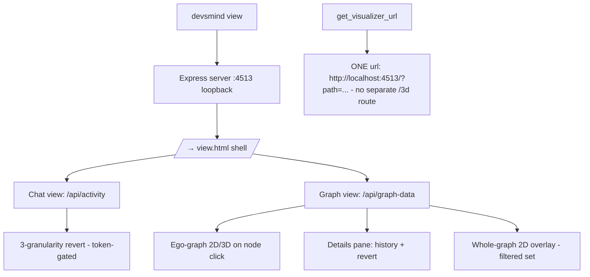

**✅ Verify during testing** — thinnest automated coverage of any area (HTTP routes only, no browser driver), so this one genuinely needs eyes:
- [ ] `devsmind view` opens the browser to the correct `?path=`.
- [ ] `get_visualizer_url` returns a URL that actually loads — no dead `/3d` link any more.
- [ ] Chat view shows sessions→messages with expandable per-file diffs.
- [ ] Message / file / edit revert buttons work from the UI (token-authenticated).
- [ ] Side-by-side vs unified diff toggle persists.
- [ ] Graph view loads all nodes; search + type/developer/date filters work and persist per-brain.
- [ ] Clicking a node renders the ego-graph (uses/used-by), 2D and 3D both render.
- [ ] Whole-graph 2D overlay reflects current filters.
- [ ] Details pane history "View changes" + revert works.
- [ ] Write APIs reject requests without a valid `X-Devsmind-Token` / non-loopback origin.
- [ ] `EADDRINUSE` on port 4513 handled with a clear message.

---

## O. Sync & Persistence + AST Core (cross-cutting)

**What it does:** The backbone everything depends on — disk↔db sync and the AST parser that powers extraction, edges, and editing.

**CLI:** `sync`, `sync --analyze`
**Files:** `db/database.ts` (`syncFromDisk`, `syncToDisk`), `utils/ast.ts`, `utils/scanner.ts`, `db/schema.ts`, `cli/sync.ts`, `cli/sync-progress.ts`

**Sync detail:** `devsmind sync` runs BOTH directions in one call — `syncFromDisk` (disk → `brain.db`: reads `graph/**` + `history/*.json` + `vectors/*.json` + `workflows/`, heals legacy relative paths, rebuilds nodes/edges/history/vectors/workflows under `foreign_keys=OFF`, orphan-sweeps vectors) **then** `syncToDisk` (`brain.db` → disk: force-writes `graph/`/`vectors/`/`workflows/` JSON from current DB state). `syncFromDisk` is **critical under `--stdio`**, where the editor-spawned process never auto-syncs after `git pull`. SQLite = cache; JSON = source of truth. `node_tokens` (BM25) is the only non-synced, freely-rebuildable table.

- **Fix: `syncToDisk` never wrote `vectors/`, only `graph/` and `workflows/`** — an asymmetry with `syncFromDisk`, which reads all three. Normal operation didn't depend on it (`writeVectorsToDisk` runs immediately alongside every embedding write, same as `writeGraphToDisk` does for graph JSON), but it meant `devsmind sync` — the tool that exists specifically to force a resync after `vectors/*.json` got deleted, corrupted, or silently failed to write — couldn't actually repair `vectors/`. Fixed: `syncToDisk` now calls `writeVectorsToDisk` alongside `writeGraphToDisk` for every node's file_path.
- **Fix: EISDIR crash on `devsmind sync`.** A production brain had a node whose `file_path` was literally a directory (a repo root, or the workspace root) rather than a real file — `toRepoRelativePath` collapses to `''`/`'{repo}/'`/`'..'` for those, which made `writeGraphToDisk`/`writeVectorsToDisk` try to write a JSON *file* at the `graph/`/`vectors/` directory itself (or an ancestor of it), throwing `EISDIR: illegal operation on a directory` — repeatedly, once per distinct malformed `file_path` string in the `Set` `syncToDisk` iterates. New `isDegenerateDiskJsonPath` guard (three checks: empty/trailing-slash `diskRelPath`, a `path.relative` that resolves to `''`/starts with `..`, and an existsSync+isDirectory catch-all) refuses the write and prints one clear warning instead, pointing at `devsmind analyze --fix` — which now actually cleans up the offending node (see area I).

**AST core (`ast.ts`) — the crown jewel:**
- **TypeScript-compiler-based** (no tree-sitter). Full parse/edges/editing for `.ts .tsx .js .jsx .mjs .cjs .vue .svelte` (SFCs masked to script blocks preserving offsets). The **12 other languages** (py/go/java/cs/rb/php/rs/swift/kt/dart) get **regex identifiers only — no spans, no edges, no in-place editing.**
- **Extraction:** `enumerateFileCandidates` (every declaration), `isNodeExported` (auto-accept signal), RTK Query adapter (`detectRtkEndpointAliases` synthesizes generated hook names by naming convention).
- **Edge resolution (`resolveConnectionsLocally`):** scope-aware free-variable analysis (`collectFreeReferences`), import resolution (tsconfig paths, barrels, re-exports), class-member gating, **isolation-failure conservatism** (suppress same-file/no-import links when a symbol's subtree can't be isolated — the main defense against all-to-all false edges).
- **Write-side:** `findTouchedSymbols` (which symbols an edit changed, by span not name), `locateNodeInFile`, exact-match editing via `utils/edit.ts`.

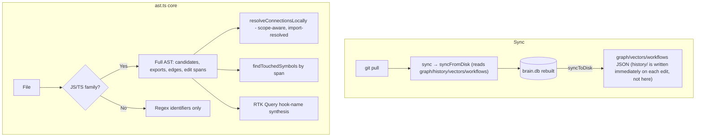

**✅ Verify during testing:**
- [ ] `sync` after a `git pull` (stdio mode) brings `brain.db` current; delta counts correct.
- [ ] `sync` detects a corrupt/unreadable `brain.db` rather than reporting a false "+N".
- [ ] Deleting `brain.db` and re-syncing reconstructs the graph losslessly from JSON.
- [ ] `.vue` / `.svelte` files parse (script block only); offsets map to the real file.
- [ ] A Python/Go file gets identifier-level nodes only (no false edges).
- [ ] Edge resolution does **not** all-to-all cross-link on isolation failure.
- [ ] `findTouchedSymbols` correctly attributes an edit to the right symbol by span (survives renames).
- [ ] RTK Query: caller→endpoint edge exists via the generated `useXQuery` hook alias.
- [ ] `vectors/` sync round-trips (base64), deprecated nodes excluded, wrong-model vectors swept.
- [ ] Windows path case-folding: no duplicate/case-collision node issues.
- [x] `syncToDisk` force-rewrites `vectors/*.json` from `node_vectors`, same as it already did for `graph/`/`workflows/` (`tests/db/sync.test.ts`).
- [x] A node whose `file_path` resolves to a directory (workspace root, repo root, or a `..`-collapsing parent) is skipped with one clear warning by `writeGraphToDisk`/`writeVectorsToDisk`, never an EISDIR crash — and never silently creates a file where `graph/`/`vectors/` should be a directory (`tests/db/database.gaps.test.ts`).
- [x] `findSpuriousAndMissingFileNodes` flags a directory-typed `file_path` as missing, and `analyze --fix` deprecates it (`tests/db/analyze.test.ts`).

---

## Appendix 1 — Unadvertised but dispatchable handlers (10)

35 advertised, 45 dispatchable. Everything below still answers if called by name but is no longer offered in `ListTools`, so an agent working from a rule written before 3.0.0 degrades instead of hard-failing. `stage_change` is **not** in this table — it was fully removed in 4.0.0 (the `case` was deleted outright) and is back as of this release, but as an **advertised, live tool again** with different semantics (see area G above), not as a retired/legacy handler.

| Handler | Status | Superseded by |
|---|---|---|
| `get_node_graph` | retired 3.0.0 | `get_node_code`'s `graph_depth`/`graph_direction`/`graph_code` |
| `get_node_history` | retired 3.0.0 | `get_node_code`'s `history:"full"` |
| `workflow_pause` | retired 3.0.0 | `workflow_bind` (kept as an unbind alias) |
| `workflow_resume` | retired 3.0.0 | `workflow_bind` (kept as a bind alias) |
| `search_decisions` | retired 3.0.0 | `search_nodes` — already searches every revision's reasoning |
| `get_orphaned_nodes` | retired 3.0.0 | `analyze_graph` reports orphans with everything else |
| `update_history` | legacy | `edit_node` + `commit_changes` |
| `add_node` | legacy | `edit_node` / commit |
| `add_connection` | legacy | commit edge resolution / `link_nodes` |
| `search_code` | legacy | folded into `search_nodes` |

Fully removed — the `case` is gone too, so calling these errors: `workflow_search`, `workflow_get_steps`, `workflow_add_artifact`, `workflow_read_artifact`, `workflow_sync_retroactive`, `get_recent_changes`, `get_developer_activity`, `get_changes_by_requirement`.

**✅ Verify:** decide whether the 4 pre-3.0 `legacy` rows earn their keep. The 6 `retired 3.0.0` rows should stay for at least one release — they are the soft landing for anyone who hasn't re-run `devsmind rule`. A test asserts the retired names are absent from `listTools()`; a separate test asserts `stage_change` IS advertised and traces/stages an already-applied edit without writing to the file (`tests/mcp/tools.test.ts`).

---

## Appendix 2 — Discrepancies from the pre-3.0 audit

All five have been resolved. Kept as a record of what was wrong, and of the fix, so a future audit doesn't re-litigate them:

1. ~~**Port in comments:** some JSDoc said **4500** while all code used **4513**.~~ **Fixed** — the three stale references in `mcp/server.ts` now say 4513.
2. ~~**Tool count:** docs said "45 tools", the server advertised 42.~~ **Fixed** — the real number is **35 advertised / 45 dispatchable**, and README, `detailExplanation.md` and this doc all say so. Verify with the one-liner in the note below rather than trusting any prose.
3. ~~**CLI version string:** `.version('1.0.0')` while `package.json` was on 2.x.~~ **Fixed** — it drifted for the entire project history because it was hardcoded next to the real number. `src/utils/version.ts` reads `package.json` at runtime, and the CLI, the MCP `serverInfo` and `GET /health` all derive from it, so there is one number and nothing left to sync.
4. **Deprecated flags still accepted:** `--chunk-size`, `--chunk-overlap`, `--local-edges` remain no-ops on `index`/`reindex`. **Deliberately kept** — `--local-edges` is documented as `[Deprecated]` in its own help text, and silently accepting a flag from someone's saved shell script beats erroring on it. Still worth a decision before removing.
5. ~~**`get_visualizer_url`** advertised a `/3d?path=` URL.~~ **Fixed** — confirmed there was no such route (16 Express routes, none `/3d`), so the link 404'd. It returns one `url` plus a note about the in-page toggle.

> **Counting tools, reliably:** `node -e "const l=require('fs').readFileSync('src/mcp/server.ts','utf-8').split('\n'); console.log(new Set((l.slice(381,1092).join('\n').match(/name: '[a-z_]+'/g)||[]).map(n=>n.slice(7,-1))).size)"` — reads the `ListTools` block directly. Any number written in prose will drift; this won't.

---

## How to use this document for the 3.0.0 test pass

1. Go area-by-area (A→O). For each, run the **✅ Verify** checklist against a real repo.
2. **Skip what the `[x]` items already cover** — those are asserted by the 1127-test suite and re-testing them by hand is time spent on the wrong risk. Spend the effort on what tests genuinely can't reach: real LLM providers (area B), the ONNX embedder (D), a real browser (N), the `init` wizard (A), and a real IDE actually reading a config DevsMind wrote (A).
3. Note failures with the file reference from that area's **Files** line.
4. The three ⚠️ blocks (areas A, M, N) are bugs fixed in 3.0.0 that had *shipped* — worth confirming on your own machine and your own configs, since that is where the damage would already be.
5. Nothing here requires new features — every item tests an already-built capability.
