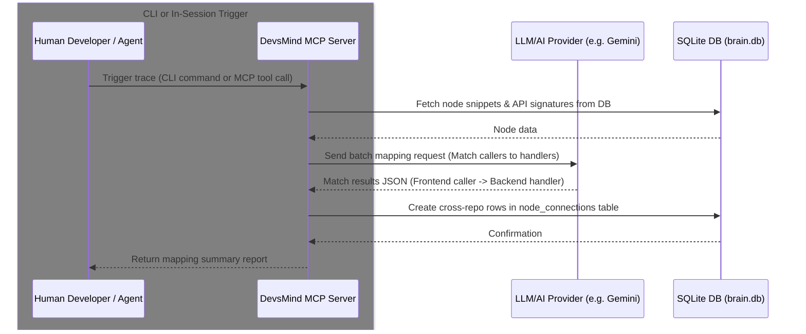
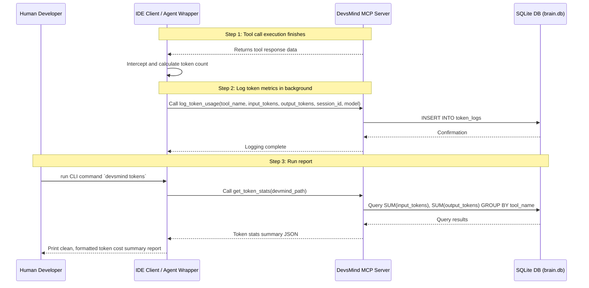

# DevsMind — Next Core Features Roadmap

This document outlines the evaluation, prioritization, and specifications of future growth areas for the DevsMind Team AI Brain platform, based on real agent feedback and developer observation.

---

## 📊 Core Feature Roadmap & Prioritization

We have categorized future enhancements into actionable phases based on implementation complexity and value added to both human developers and AI coding agents.

> **Design Constraint:** All features must operate in a **fully closed environment** — zero external services, zero vector databases, zero API costs. Everything runs locally using the existing SQLite graph.

> **Already implemented?** Anything shipped and confirmed working moves to [implemented.md](implemented.md) and is removed from here — this file tracks only what's still outstanding.

### Phase 2: Cross-Service Awareness

#### 2. Cross-Repo Trace Mapping (HTTP / Event Tracing)
*   **Goal**: Trace logical flow across multiple repository directories (e.g., Frontend calling Backend REST endpoints, or Backend pushing SQS/Kafka events).
*   **Why We Are Building This**: Today the graph works within a single repository. Most real projects are split — a frontend repo, a backend repo, and possibly shared services. Without this, the AI working on the frontend has to guess what the backend function signature looks like, what it returns, or whether it still exists. Guessing is where bugs are introduced.
*   **Implementation (AI-Driven Mapping)**:
    *   **LLM-Powered Mapping**: Instead of fragile, language-specific AST parsers (which break across different languages like Java, TS, Python, Go, Rust), DevsMind uses the LLM to inspect node signatures, docstrings, and code snippets to match API routes/event publishers to their respective client callers.
    *   **Dual Execution Pathways**:
        1.  **CLI Command (`devsmind trace --run`)**: A terminal command that developers can run on-demand to perform a batch LLM sweep matching all nodes across the repositories.
        2.  **In-Session Incremental Tracing**: As the AI agent edits files and calls `update_history`, it evaluates if the edited node is an API interface and dynamically re-scans/maps connections using the active LLM context.
    *   **Zero-Db Bloat**: Cross-repo connections are written directly into the existing `node_connections` table.
*   **Who Benefits**:
    *   **Vibe Coder**: Ask the AI questions spanning frontend + backend and get accurate, grounded answers instead of hallucinated guesses.
    *   **Team Devs**: No more "I didn't know the frontend was calling that endpoint" surprises when changing an API contract.
    *   **New Devs Joining**: Can see the full system map on day one without reading all code manually.

---

### Phase 5: Token & Cost Telemetry

#### 5. Token Usage & Cost Logging (`log_token_usage`)
*   **Goal**: Monitor, track, and log the exact input and output token consumption of all MCP tools and LLM operations, providing local metrics on developer and AI agent interaction costs.
*   **Why We Are Building This**: Vibe coding can be expensive, and developers need visibility into their token expenditure. By logging the token usage of each tool call, developers can identify token-heavy components, track costs over time, and see exactly which operations (e.g. cross-repo trace scans or massive history reads) are consuming the most resources.
*   **Implementation**:
    *   **Telemetry database logger**: Add a local SQLite logging table to record token counts.
    *   **Double-ended capture**:
        *   **Client-Side Logs**: The IDE client or wrapper logs the input/output tokens of every chat message and tool execution by calling `log_token_usage`.
        *   **Server-Side Logs**: For server-side LLM calls (such as Phase 2 `trace_cross_repo_connections`), the MCP server automatically records its own LLM usage metrics directly.
    *   **CLI Telemetry Report**: Introduce a terminal command `devsmind tokens` to output a clean, formatted report of session costs, token usage by model, and tool-by-tool statistics.
*   **Who Benefits**:
    *   **Vibe Coder**: Clear understanding of session cost and token usage trends.
    *   **Team Devs**: Identify token leaks or inefficient tools that need optimization.

---

### Phase 6: Non-AST Language Cross-Reference Resolution

#### 6. Call-Edge Resolution for Non-AST Languages (Python, Go, Java, C#, Ruby, PHP, Rust, Swift, Kotlin, Dart)
*   **Goal**: Make `stage_change`/`commit_changes` actually resolve caller/callee edges for the ~10 non-TS/JS languages the graph already indexes — today it doesn't, silently.
*   **Why We Are Building This**: `resolveConnectionsLocally()` in `src/utils/ast.ts` only has a real parser for TypeScript/JavaScript. For every other indexed language it falls back to a whole-file regex identifier scan and immediately sets `isolationFailed = true`, which gates off every edge-creating branch. The practical effect: a Python method calling another method on the same class produces **zero edges**, every node in a non-AST-language file shows up in `get_orphaned_nodes`, and `get_node_graph`'s caller/callee traversal is empty for those languages. This directly contradicts `stage_change`'s own tool description, which says connections are "resolved automatically" — for these languages, right now, they are not. This was found and confirmed during a hardcore adversarial test pass (2026-07-17): a Python `restock_all()` calling `manager.add_stock()` produced no edge, and all 4 seeded Python nodes came back as orphaned.
*   **Implementation (candidate approaches)**:
    *   **Regex-based same-file resolution first** (cheapest, closest to today's architecture): instead of unconditionally setting `isolationFailed = true` for non-TS/JS files, isolate the target symbol's own text block (already partially done via `collectRegexNames`) and match call-like identifier patterns (`name(`, `self.name(`, `obj.name(`) against other known symbols in the same file. Same-file resolution alone would close the most common case (a class calling its own methods) without needing a real parser per language.
    *   **Tree-sitter as a longer-term option**: tree-sitter has mature grammars for every language in `INDEXABLE_EXTENSIONS` and could replace the regex fallback with real AST spans (mirroring what `locateNodeInFile`/`findTouchedSymbols` already do for TS/JS), enabling not just edge resolution but also `edit_node`-style symbol-addressed editing for these languages. Bigger lift — a new dependency and a per-language node-type mapping — but removes the "TS/JS only" ceiling from multiple features at once, not just this one.
    *   Either approach should ship with a directly-testable regression: seed a same-file same-language caller/callee pair, commit, and assert `edges_added >= 1` — the class of bug that let this slip through undetected.
*   **Who Benefits**:
    *   **Vibe Coder on a non-JS stack**: `get_node_graph`, `get_orphaned_nodes`, and blast-radius analysis become meaningful instead of silently empty.
    *   **Team Devs**: The tool's own claims (`stage_change`'s description, `get_orphaned_nodes`) become trustworthy for every language the product claims to support, not just TS/JS.

---

### Phase 7: Reindex File-Deletion Detection

#### 7. `reindex` Should Deprecate Nodes for Deleted Files
*   **Goal**: Make `devsmind reindex` notice when a previously-indexed file has been deleted from disk and deprecate its nodes as part of the same run — today it doesn't.
*   **Why We Are Building This**: `runBackgroundReindexing()` in `src/cli/runner.ts` only ever iterates files that `scanRepoFiles` currently finds on disk (both its mtime-diff path and `--fill-gaps` mode). There is no code path that asks "does every INDEXED file still exist?" — so a node whose file was deleted keeps reporting as live, keeps showing up in searches and graph traversals, and `reindex` prints `✅ Code graph is already up to date. No modified files detected.` even though it's now stale. This was confirmed during the 2026-07-17 hardcore test pass: seeding a node, deleting its file, then running `reindex` left the node fully active; a subsequent `analyze` run (a *separate* command) was needed to catch it. This is a real gap — `reindex`'s own description implies deletions are handled as part of "synchronizing the graph with manual changes," and a user has no way to know they need to remember a second, unrelated command.
*   **Implementation**:
    *   In `runBackgroundReindexing`, after the current disk scan, diff the set of files `scanRepoFiles` returns against the set of distinct `file_path`s already present in the graph for that repo (`db.getNodesByFilePath`-style query, batched). Any indexed file path with no corresponding entry in the fresh scan has been deleted.
    *   Deprecate (never hard-delete, matching the existing soft-delete convention used by `analyze --fix`) every node whose `file_path` falls in that "missing" set, and report the count in `reindex`'s own summary output (`Deprecated N node(s) from M deleted file(s).`) so it's visible in the same run, not a downstream surprise.
    *   This is a strict subset of what `analyze`'s "Local Filesystem & Git Rename Check" (see [implemented.md](implemented.md) Phase 2) already does for missing files — the fix is to run that same missing-file check as part of `reindex` itself, not to build new detection logic from scratch.
*   **Who Benefits**:
    *   **Vibe Coder**: `reindex` alone is enough to trust the graph again after deleting/moving files, without needing to separately remember `analyze --fix`.
    *   **AI Agent**: Never traces a caller/callee edge into a function that no longer exists on disk.

---

## 📈 Impact Scorecard

| Feature | Developer Value | AI Agent Value | Complexity to Build | Priority |
| :--- | :--- | :--- | :--- | :--- |
| **Cross-Repo Trace Mapping** | 🔥 Very High — full system visibility across services | 🔥 Very High — eliminates hallucinated API guesses | Medium | **High** |
| **Token & Cost Telemetry** | ✅ Medium — cost visibility and reporting | 🔥 High — identifies token leaks/bloat | Low | **High** |
| **Non-AST Call-Edge Resolution** | 🔥 High — fixes a silent correctness gap for every non-TS/JS language | 🔥 Very High — `get_node_graph`/orphan detection currently return empty for these languages | Medium (regex same-file) / High (tree-sitter) | **High** |
| **Reindex File-Deletion Detection** | ✅ Medium — one command stays trustworthy instead of two | ✅ Medium — avoids tracing into deleted code | Low | **Medium** |

---

## 🏗️ Technical Architecture & Implementation Design

### 1. Database Schema Updates (SQLite)

We outline below the database schema changes required for all implementation phases. To maintain maximum performance and compatibility, schema updates are kept lightweight and utilize SQLite's native capabilities.

#### Phase 2: Cross-Service Awareness
* **Schema Changes:** None. Reuses the existing `nodes` and `node_connections` tables. 
* **Design Note:** Cross-repository files are referenced via workspace-relative paths stored in the `file_path` field. The active repository mappings (absolute local paths mapped to logical workspace names) are loaded dynamically from `.devmind/config.json`. Tracing is executed either in batch mode via the CLI (`devsmind trace --run`) using the LLM, or dynamically in-session during history updates.

#### Phase 5: Token & Cost Telemetry
* **Schema Changes:** Adds a new telemetry table `token_logs` to record input/output tokens per session/tool.

```sql
-- Telemetry Logs
CREATE TABLE IF NOT EXISTS token_logs (
  id TEXT PRIMARY KEY,
  session_id TEXT,
  tool_name TEXT NOT NULL,
  input_tokens INTEGER NOT NULL,
  output_tokens INTEGER NOT NULL,
  provider TEXT,
  model TEXT,
  created_at DATETIME DEFAULT CURRENT_TIMESTAMP
);
```

#### Phase 6 & 7
* **Schema Changes:** None for either. Phase 6 reuses the existing `node_connections` table (it's a resolution-logic fix, not a storage change). Phase 7 reuses the existing `nodes.deprecated` soft-delete flag `analyze --fix` already uses.

---

### 2. MCP Tool Specifications

The following MCP tool specifications define the API endpoints exposed by the DevsMind server across all phases.

#### 🌐 Phase 2 Tools: Cross-Service Awareness

##### `trace_cross_repo_connections`
* **Description:** Leverages the active LLM provider to match workspace API routing endpoints, event publishers, or consumer schemas against client call sites, dynamically creating cross-repo edges in the SQLite database.
* **Input Schema:**
  ```json
  {
    "type": "object",
    "properties": {
      "devmind_path": {
        "type": "string",
        "description": "Absolute path to the .devmind directory"
      },
      "workspace_root": {
        "type": "string",
        "description": "Absolute path to the directory containing all repository folders"
      },
      "provider": {
        "type": "string",
        "description": "LLM provider to use (e.g. gemini, vertex, openai)"
      },
      "model": {
        "type": "string",
        "description": "LLM model name to use"
      }
    },
    "required": ["devmind_path", "workspace_root"]
  }
  ```
* **Output Format:**
  ```json
  {
    "status": "success",
    "connections_created": 8,
    "matched_endpoints": [
      { "source_repo": "frontend-web", "source_node": "axios.get('/api/users')", "target_repo": "backend-service", "target_node": "UserController.getUsers" }
    ],
    "unresolved_endpoints": [
      { "repo": "frontend-web", "endpoint": "POST /api/unknown", "caller_node": "paymentClient.charge" }
    ]
  }
  ```

#### 📊 Phase 5 Tools: Token & Cost Telemetry

##### `log_token_usage`
* **Description:** Records the token usage of an LLM request or an MCP tool run in the telemetry database.
* **Input Schema:**
  ```json
  {
    "type": "object",
    "properties": {
      "devmind_path": { "type": "string", "description": "Absolute path to the .devmind directory" },
      "tool_name": { "type": "string", "description": "Name of the tool or LLM action logged" },
      "input_tokens": { "type": "integer", "description": "Number of input/read tokens used" },
      "output_tokens": { "type": "integer", "description": "Number of output/generated tokens used" },
      "session_id": { "type": "string", "description": "Optional active session identifier" },
      "provider": { "type": "string", "description": "Optional LLM provider (e.g. gemini, vertex)" },
      "model": { "type": "string", "description": "Optional model identifier" }
    },
    "required": ["devmind_path", "tool_name", "input_tokens", "output_tokens"]
  }
  ```
* **Output Format:** `{ "status": "success", "logged_id": "log_123e4567" }`

##### `get_token_stats`
* **Description:** Retrieves aggregated token usage metrics, cost analysis, and tool-by-tool statistics from the SQLite database.
* **Input Schema:**
  ```json
  {
    "type": "object",
    "properties": {
      "devmind_path": { "type": "string", "description": "Absolute path to the .devmind directory" },
      "session_id": { "type": "string", "description": "Optional filter by a specific session ID" },
      "timeframe_hours": { "type": "integer", "description": "Optional lookback window in hours (default: all time)" }
    },
    "required": ["devmind_path"]
  }
  ```
* **Output Format:**
  ```json
  {
    "status": "success",
    "total_input_tokens": 124500,
    "total_output_tokens": 12800,
    "estimated_cost_usd": 0.35,
    "breakdown_by_tool": [
      { "tool_name": "update_history", "calls": 8, "input_tokens": 42000, "output_tokens": 9600 },
      { "tool_name": "get_node_summary", "calls": 48, "input_tokens": 14000, "output_tokens": 800 }
    ],
    "breakdown_by_model": [
      { "model": "gemini-2.5-flash", "input_tokens": 124500, "output_tokens": 12800 }
    ]
  }
  ```

---

### 3. Architectural Flows

Below are visual and logical sequences explaining how these phases orchestrate and operate within the workspace.

#### Flow B: Cross-Repo REST/Event Contract Tracing (Phase 2)
This flow traces how cross-repo connections are matched using the LLM/AI provider, supporting both batch execution (via CLI `devsmind trace`) and incremental in-session updates.



#### Flow F: Token Usage Logging & Cost Reporting (Phase 5)
This flow shows how token metrics are captured, logged into SQLite, and later queried to generate cost reports.


