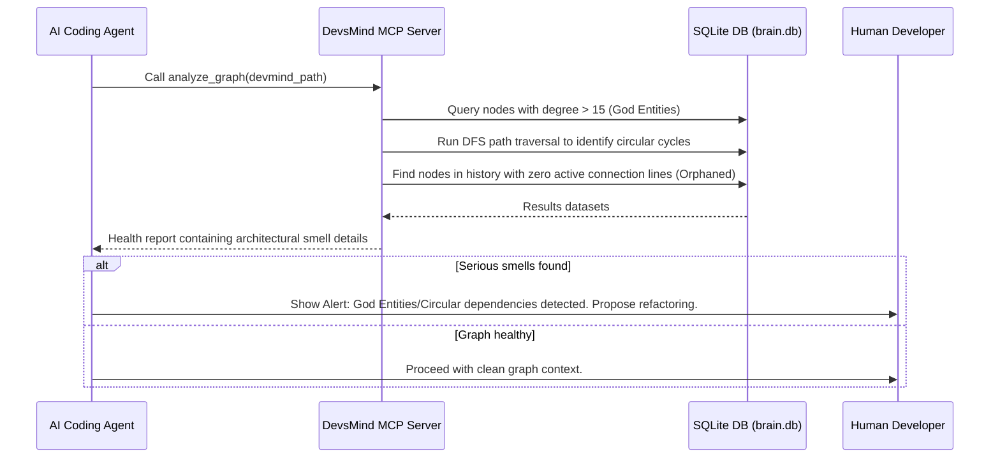
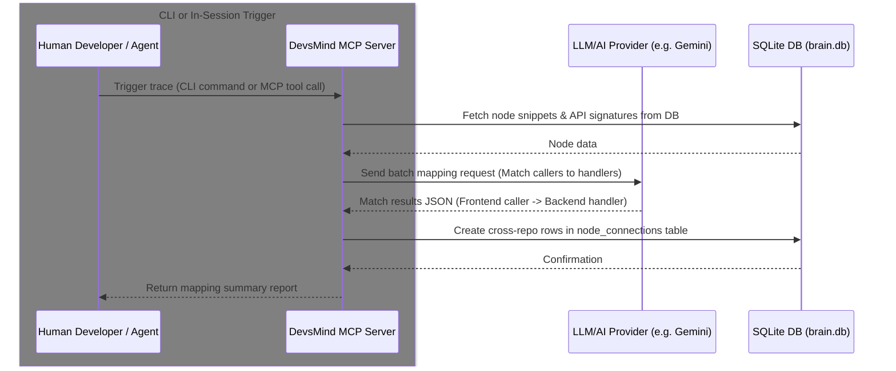
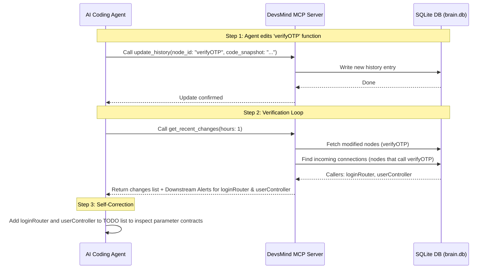
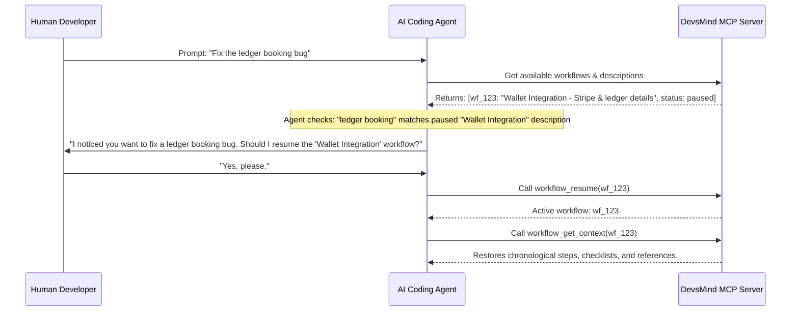
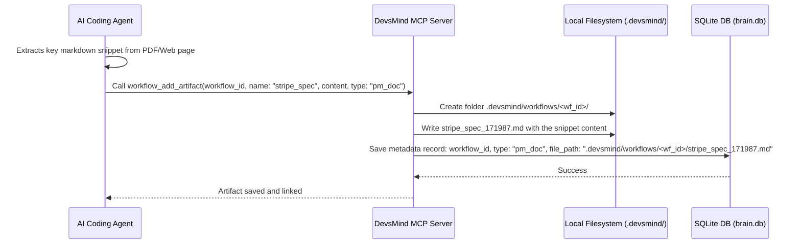
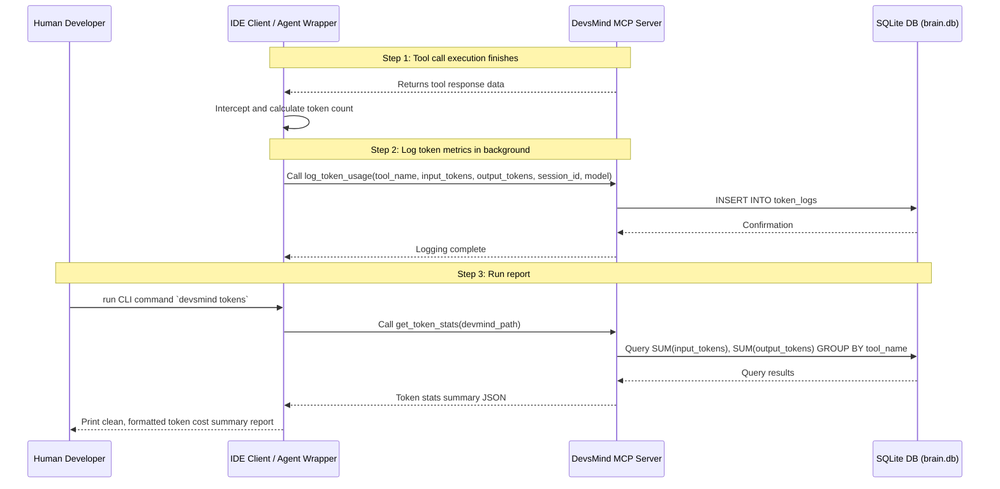
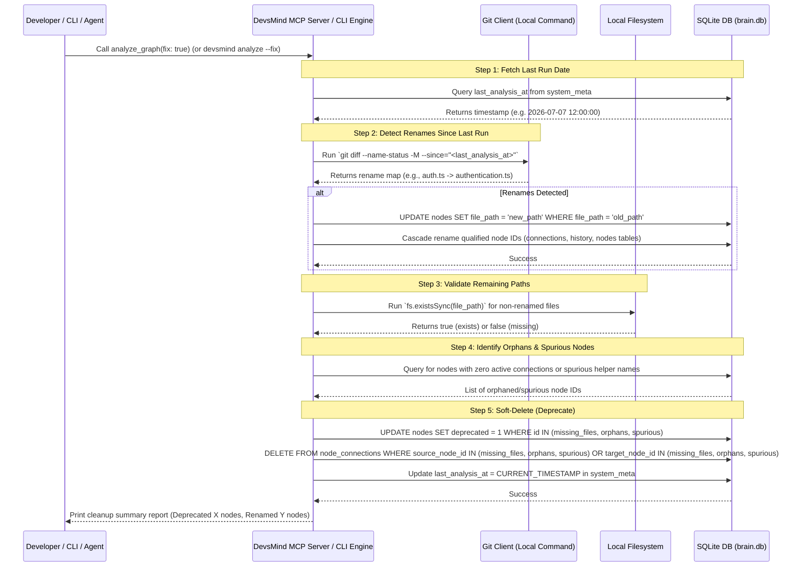

# DevsMind — Next Core Features Roadmap

This document outlines the evaluation, prioritization, and specifications of future growth areas for the DevsMind Team AI Brain platform, based on real agent feedback and developer observation.

---

## 📊 Core Feature Roadmap & Prioritization

We have categorized future enhancements into actionable phases based on implementation complexity and value added to both human developers and AI coding agents.

> **Design Constraint:** All features must operate in a **fully closed environment** — zero external services, zero vector databases, zero API costs. Everything runs locally using the existing SQLite graph.

### Phase 1: Graph Health & Integrity

#### 1.1. Graph Health & Integrity (`analyze_graph` & `devsmind analyze`)
*   **Goal**: Run structural analysis algorithms over the existing SQLite graph (detect circular dependencies, God entities, orphaned/abandoned nodes) and perform local, token-free cleanup (such as Git-native file rename detection, spurious node checks, and soft-delete deprecations) under a single entry point.
*   **Why We Are Building This**: Over weeks of vibe coding across a team, the graph quietly accumulates dead connections, circular dependencies, and nodes that point to deleted or renamed files. This consolidated utility keeps the graph healthy and clean, ensuring that the AI works on a precise, optimized context without wasting tokens or getting caught in infinite reasoning loops.
*   **Detections & Analysis**:
    *   **God Entities**: Detect nodes with more than 15 callers/dependencies. Spots architectural bottlenecks early.
    *   **Circular References**: DFS-based circular dependency cycle path tracer. Stops the AI from entering infinite reasoning loops when tracing context.
    *   **Orphaned/Abandoned Nodes**: Finds nodes with history records or active definitions but zero active connections to/from other nodes.
    *   **Local Filesystem & Git Rename Check**:
        *   Checks `last_analysis_at` in the `system_meta` table.
        *   Queries Git for rename actions (`git diff --name-status -M`) looking at commits since `last_analysis_at`. If a rename is found, it automatically updates the node's `file_path` and cascades the rename across qualified node IDs in `nodes`, `node_connections`, and `history` tables, preserving precious evolutionary change logs.
        *   Checks filesystem existence for other non-renamed files.
    *   **Spurious/Built-in Nodes**: Identifies common language primitives/built-ins (`promise`, `map`, etc.) that were accidentally indexed.
*   **Action Modes (Fix vs. Dry-Run)**:
    *   **Dry-Run (Default)**: Summarizes all detected issues (circular cycles, god entities, orphaned nodes, renamed files, spurious entries, missing files) without modifying the database.
    *   **Fix Mode**: Triggered via `fix: true` in the MCP tool or `--fix` in the CLI. Applies soft deprecation (marking nodes as `deprecated = 1` and deleting their connections in `node_connections`, **preserving history**) and rename migrations.
*   **Dual Execution Pathways**:
    *   **MCP Integration**: Expose `analyze_graph` tool accepting `fix: boolean` and `god_entity_threshold: number`.
    *   **CLI Command (`devsmind analyze`)**: Run health check and rename cleanup manually from the terminal. Accepts `--fix` to apply the migrations.
*   **Performance**: Runs in milliseconds entirely on local SQLite and Git APIs, consuming **zero LLM tokens**.
*   **Optimization (Cache Tracking)**: Tracks `last_analysis_at` in the `system_meta` table. If no new history records or connection updates have been written to the database since the last analysis, it returns the cached health analysis report instantly (unless `fix` mode is requested or cache is invalidated).
*   **Who Benefits**:
    *   **Vibe Coder**: AI always works on a clean, accurate graph → better, more reliable code generation.
    *   **Team Devs**: Spots architectural problems before they become production bugs.
    *   **AI Agent**: Does not waste context window on stale nodes or confused dependency chains.

---

### Phase 2: Cross-Service Awareness

#### 2. Cross-Repo Trace Mapping (HTTP / Event Tracing)
*   **Goal**: Trace logical flow across multiple repository directories (e.g., Frontend calling Backend REST endpoints, or Backend pushing SQS/Kafka events).
*   **Why We Are Building This**: Today the graph works within a single repository. Most real projects are split — a frontend repo, a backend repo, and possibly shared services. Without this, the AI working on the frontend has to guess what the backend function signature looks like, what it returns, or whether it still exists. Guessing is where bugs are introduced.
*   **Implementation (AI-Driven Mapping)**:
    *   **LLM-Powered Mapping**: Instead of fragile, language-specific AST parsers (which break across different languages like Java, TS, Python, Go, Rust), DevsMind uses the LLM to inspect node signatures, docstrings, and code snippets to match API routes/event publishers to their respective client callers.
    *   **Dual Execution Pathways**:
        1.  **CLI Command (`devsmind trace --run`)**: A terminal command that developers can run on-demand to perform a batch LLM sweep matching all nodes across the repositories.
        2.  **In-Session Incremental Tracing**: As the AI agent edits files and calls `update_history`, it evaluates if the edited node is an API interface and dynamically re-scans/maps connections using the active LLM context.
    *   **Zero-Db Bloat**: Cross-repo connections are written directly into the existing `node_connections` table.
*   **Who Benefits**:
    *   **Vibe Coder**: Ask the AI questions spanning frontend + backend and get accurate, grounded answers instead of hallucinated guesses.
    *   **Team Devs**: No more "I didn't know the frontend was calling that endpoint" surprises when changing an API contract.
    *   **New Devs Joining**: Can see the full system map on day one without reading all code manually.

---

### Phase 4: Workflow Context Vault (Feature Sessions)

#### 4. Persistent Feature Memory & Milestones
*   **Goal**: Provide long-term institutional memory for the AI across multiple vibe coding sessions spanning days or weeks.
*   **Why We Are Building This**: AI agents suffer from "context death" when a session ends. When you resume a feature like "Wallet Integration" days later, the AI forgets the journey, decisions, bugs fixed, and reference materials used. This feature creates a chronological narrative of a feature's development that survives session restarts.
*   **Implementation**:
    *   **Workflow Steps**: A new SQLite table tracks high-level steps, bug fixes, decisions, and pending tasks. To save space, it does **not** duplicate code snapshots — it simply links to the IDs of existing `history` nodes.
    *   **Filesystem Artifacts**: External reference materials (PDF extracts, PM docs, web search snippets) used by the AI are saved as lightweight text files in a local directory (`.devsmind/workflows/<workflow_id>/`). The database only stores the file paths, keeping the SQLite DB lean and fast.
    *   **Session Continuity**: When resuming a workflow, the AI loads the chronological summary and reads the linked artifact files, instantly regaining full context without a manual re-briefing.
    *   **Proactive AI Guardrails**: Workflows have a brief `description` (like MCP tools). If the user starts working on a related task without explicitly resuming the workflow, the AI detects the conceptual match and proactively asks: *"Should I add this to the paused Wallet Integration workflow?"*
    *   **Retroactive Sync**: If a user forgets to use a workflow for an entire session, they can request a retroactive sync. The AI reads the current chat transcript, extracts the steps and decisions made, and injects them into the workflow timeline after the fact.
*   **Who Benefits**:
    *   **Vibe Coder**: Can pause and resume complex features across weeks without losing momentum or explaining context twice.
    *   **AI Agent**: Regains deep contextual memory instantly upon loading the workflow.

### Phase 5: Token & Cost Telemetry

#### 5. Token Usage & Cost Logging (`log_token_usage`)
*   **Goal**: Monitor, track, and log the exact input and output token consumption of all MCP tools and LLM operations, providing local metrics on developer and AI agent interaction costs.
*   **Why We Are Building This**: Vibe coding can be expensive, and developers need visibility into their token expenditure. By logging the token usage of each tool call, developers can identify token-heavy components, track costs over time, and see exactly which operations (e.g. cross-repo trace scans or massive history reads) are consuming the most resources.
*   **Implementation**:
    *   **Telemetry database logger**: Add a local SQLite logging table to record token counts.
    *   **Double-ended capture**:
        *   **Client-Side Logs**: The IDE client or wrapper logs the input/output tokens of every chat message and tool execution by calling `log_token_usage`.
        *   **Server-Side Logs**: For server-side LLM calls (such as Phase 2 `trace_cross_repo_connections`), the MCP server automatically records its own LLM usage metrics directly.
    *   **CLI Telemetry Report**: Introduce a terminal command `devsmind tokens` to output a clean, formatted report of session costs, token usage by model, and tool-by-tool statistics.
*   **Who Benefits**:
    *   **Vibe Coder**: Clear understanding of session cost and token usage trends.
    *   **Team Devs**: Identify token leaks or inefficient tools that need optimization.

---

## 📈 Impact Scorecard

| Feature | Developer Value | AI Agent Value | Complexity to Build | Priority |
| :--- | :--- | :--- | :--- | :--- |
| **Graph Health & Integrity** | 🔥 High — exposes architectural rot early | 🔥 High — cleaner reasoning context | Low | **Critical** |
| **Cross-Repo Trace Mapping** | 🔥 Very High — full system visibility across services | 🔥 Very High — eliminates hallucinated API guesses | Medium | **High** |
| **Enhanced Recent Changes** | [DONE] Surfaced downstream warnings in get_recent_changes | [DONE] | - | - |
| **Workflow Context Vault** | 🔥 Very High — true project continuity | 🔥 Very High — solves context death | Medium | **Critical** |
| **Token & Cost Telemetry** | ✅ Medium — cost visibility and reporting | 🔥 High — identifies token leaks/bloat | Low | **High** |

---

## 🏗️ Technical Architecture & Implementation Design

### 1. Database Schema Updates (SQLite)

We outline below the database schema changes required for all implementation phases. To maintain maximum performance and compatibility, schema updates are kept lightweight and utilize SQLite's native capabilities.

#### Phase 1: Graph Health & Integrity
* **Schema Changes:** Adds a lightweight metadata table `system_meta` to keep track of execution timestamps for incremental processing and caching.

```sql
-- System Metadata / Cache Tracking
CREATE TABLE IF NOT EXISTS system_meta (
  key TEXT PRIMARY KEY,
  value TEXT NOT NULL,
  updated_at DATETIME DEFAULT CURRENT_TIMESTAMP
);
```

#### Phase 2: Cross-Service Awareness
* **Schema Changes:** None. Reuses the existing `nodes` and `node_connections` tables. 
* **Design Note:** Cross-repository files are referenced via workspace-relative paths stored in the `file_path` field. The active repository mappings (absolute local paths mapped to logical workspace names) are loaded dynamically from `.devmind/config.json`. Tracing is executed either in batch mode via the CLI (`devsmind trace --run`) using the LLM, or dynamically in-session during history updates.

#### Phase 3: Agent Self-Correction
* **Schema Changes:** None. Runs graph traversal joins dynamically across the existing `node_connections` and `history` tables during tool execution.

#### Phase 4: Workflow Context Vault (Feature Sessions)
* **Schema Changes:** Adds three new tables to store persistent session history, steps, and local reference file attachments:

```sql
-- Core Workflow Container
CREATE TABLE IF NOT EXISTS workflows (
  id TEXT PRIMARY KEY,
  name TEXT NOT NULL,
  description TEXT NOT NULL, -- Used by AI for proactive detection guardrail
  status TEXT DEFAULT 'active', -- active, paused, completed
  created_at DATETIME DEFAULT CURRENT_TIMESTAMP,
  updated_at DATETIME DEFAULT CURRENT_TIMESTAMP
);

-- Chronological Steps (Links to existing history instead of duplicating code)
CREATE TABLE IF NOT EXISTS workflow_steps (
  id TEXT PRIMARY KEY,
  workflow_id TEXT NOT NULL,
  step_index INTEGER NOT NULL,
  summary TEXT NOT NULL,
  pending_tasks TEXT,
  history_ids TEXT, -- JSON array of history record IDs 
  session_id TEXT,
  created_at DATETIME DEFAULT CURRENT_TIMESTAMP,
  FOREIGN KEY (workflow_id) REFERENCES workflows(id) ON DELETE CASCADE
);

-- Filesystem Artifact References (Zero binary bloat in DB)
CREATE TABLE IF NOT EXISTS workflow_artifacts (
  id TEXT PRIMARY KEY,
  workflow_id TEXT NOT NULL,
  step_id TEXT,
  type TEXT, -- 'pdf_extract', 'web_snippet', 'pm_doc'
  source_name TEXT,
  file_path TEXT NOT NULL, -- Relative path: .devsmind/workflows/<id>/
  created_at DATETIME DEFAULT CURRENT_TIMESTAMP,
  FOREIGN KEY (workflow_id) REFERENCES workflows(id) ON DELETE CASCADE
);
```

#### Phase 5: Token & Cost Telemetry
* **Schema Changes:** Adds a new telemetry table `token_logs` to record input/output tokens per session/tool.

```sql
-- Telemetry Logs
CREATE TABLE IF NOT EXISTS token_logs (
  id TEXT PRIMARY KEY,
  session_id TEXT,
  tool_name TEXT NOT NULL,
  input_tokens INTEGER NOT NULL,
  output_tokens INTEGER NOT NULL,
  provider TEXT,
  model TEXT,
  created_at DATETIME DEFAULT CURRENT_TIMESTAMP
);
```

---

### 2. MCP Tool Specifications

The following MCP tool specifications define the API endpoints exposed by the DevsMind server across all phases.

#### 📊 Phase 1 Tools: Graph Health & Integrity

##### `analyze_graph`
* **Description:** Runs graph structural analysis algorithms (cycle detection, God entity checks, and orphan scans) along with codebase synchronization checks (spurious node identification, local file existence check, and Git-native rename tracking). It can operate in read-only analysis mode or apply fixes (soft deprecation and rename cascade updates).
* **Input Schema:**
  ```json
  {
    "type": "object",
    "properties": {
      "devmind_path": {
        "type": "string",
        "description": "Absolute path to the .devmind directory"
      },
      "workspace_root": {
        "type": "string",
        "description": "Absolute path to the workspace root directory"
      },
      "fix": {
        "type": "boolean",
        "description": "If true, applies deprecations for spurious/missing nodes and updates renamed paths (default: false)"
      },
      "god_entity_threshold": {
        "type": "integer",
        "description": "Call/dependency degree threshold to identify God Entities (default: 15)"
      }
    },
    "required": ["devmind_path", "workspace_root"]
  }
  ```
* **Output Format:**
  ```json
  {
    "status": "success",
    "fixed": true,
    "summary": {
      "god_entities_found": 3,
      "circular_dependencies_found": 1,
      "orphaned_nodes_found": 12,
      "deprecated_nodes_count": 8,
      "renamed_nodes_count": 2
    },
    "god_entities": [
      { "node_id": "authService", "calls_count": 18, "file_path": "src/auth.ts" }
    ],
    "circular_dependencies": [
      ["authService.verify", "sessionService.validate", "authService.verify"]
    ],
    "orphaned_nodes": [
      { "node_id": "staleHelper", "file_path": "src/utils/stale.ts", "last_updated": "2026-05-12T04:12:00Z" }
    ],
    "deprecated_nodes": [
      { "node_id": "paymentRouter", "reason": "file_missing" },
      { "node_id": "unusedHelper", "reason": "orphaned" }
    ],
    "renamed_nodes": [
      { "old_node_id": "src/auth.ts#verifyOTP", "new_node_id": "src/authentication.ts#verifyOTP", "file_path": "src/authentication.ts" }
    ]
  }
  ```


#### 🌐 Phase 2 Tools: Cross-Service Awareness

##### `trace_cross_repo_connections`
* **Description:** Leverages the active LLM provider to match workspace API routing endpoints, event publishers, or consumer schemas against client call sites, dynamically creating cross-repo edges in the SQLite database.
* **Input Schema:**
  ```json
  {
    "type": "object",
    "properties": {
      "devmind_path": {
        "type": "string",
        "description": "Absolute path to the .devmind directory"
      },
      "workspace_root": {
        "type": "string",
        "description": "Absolute path to the directory containing all repository folders"
      },
      "provider": {
        "type": "string",
        "description": "LLM provider to use (e.g. gemini, vertex, openai)"
      },
      "model": {
        "type": "string",
        "description": "LLM model name to use"
      }
    },
    "required": ["devmind_path", "workspace_root"]
  }
  ```
* **Output Format:**
  ```json
  {
    "status": "success",
    "connections_created": 8,
    "matched_endpoints": [
      { "source_repo": "frontend-web", "source_node": "axios.get('/api/users')", "target_repo": "backend-service", "target_node": "UserController.getUsers" }
    ],
    "unresolved_endpoints": [
      { "repo": "frontend-web", "endpoint": "POST /api/unknown", "caller_node": "paymentClient.charge" }
    ]
  }
  ```

#### 🔄 Phase 3 Tools: Agent Self-Correction

##### `get_recent_changes` (Upgraded)
* **Description:** Returns history logs and changes made in the last N hours, now expanded with downstream blast-radius analysis which displays which other nodes rely on modified nodes and might require code contract updates.
* **Input Schema:**
  ```json
  {
    "type": "object",
    "properties": {
      "devmind_path": {
        "type": "string",
        "description": "Absolute path to the .devmind directory"
      },
      "hours": {
        "type": "number",
        "description": "Lookback window in hours (default: 24)"
      },
      "analyze_impact": {
        "type": "boolean",
        "description": "If true, resolves downstream callers affected by these changes (default: true)"
      }
    },
    "required": ["devmind_path"]
  }
  ```
* **Output Format:**
  ```json
  {
    "recent_changes": [
      {
        "node_id": "verifyOTP",
        "file_path": "src/authService.ts",
        "updated_at": "2026-07-07T11:00:00Z",
        "reasoning": { "what_changed": "Changed parameters to support phone logins" },
        "downstream_impact": [
          { "node_id": "postLoginHandler", "file_path": "src/loginRouter.ts", "impact_type": "stale_caller_warning" }
        ]
      }
    ]
  }
  ```

#### 🗄️ Phase 4 Tools: Workflow Context Vault

##### `workflow_create`
* **Description:** Initializes a new logical feature workflow and makes it the active tracking context.
* **Input Schema:**
  ```json
  {
    "type": "object",
    "properties": {
      "devmind_path": { "type": "string", "description": "Absolute path to the .devmind directory" },
      "name": { "type": "string", "description": "Human-readable name of the feature workflow" },
      "description": { "type": "string", "description": "Brief description of goals (used for proactive match detection)" }
    },
    "required": ["devmind_path", "name", "description"]
  }
  ```
* **Output Format:** `{ "status": "created", "workflow_id": "wf_123e4567" }`

##### `workflow_pause`
* **Description:** Pauses the currently active workflow and returns the agent to standard ad-hoc mode.
* **Input Schema:**
  ```json
  {
    "type": "object",
    "properties": {
      "devmind_path": { "type": "string", "description": "Absolute path to the .devmind directory" }
    },
    "required": ["devmind_path"]
  }
  ```
* **Output Format:** `{ "status": "paused", "paused_workflow_id": "wf_123e4567" }`

##### `workflow_resume`
* **Description:** Activates a previously paused workflow.
* **Input Schema:**
  ```json
  {
    "type": "object",
    "properties": {
      "devmind_path": { "type": "string", "description": "Absolute path to the .devmind directory" },
      "workflow_id": { "type": "string", "description": "The unique ID of the workflow to resume" }
    },
    "required": ["devmind_path", "workflow_id"]
  }
  ```
* **Output Format:** `{ "status": "active", "active_workflow_id": "wf_123e4567" }`

##### `workflow_get_context`
* **Description:** Retrieves the chronological step timeline, pending checklist items, and reference file pointers for a workflow.
* **Input Schema:**
  ```json
  {
    "type": "object",
    "properties": {
      "devmind_path": { "type": "string", "description": "Absolute path to the .devmind directory" },
      "workflow_id": { "type": "string", "description": "The ID of the target workflow" }
    },
    "required": ["devmind_path", "workflow_id"]
  }
  ```
* **Output Format:**
  ```json
  {
    "id": "wf_123e4567",
    "name": "Wallet Integration",
    "description": "Integrate Stripe payments and ledger records",
    "status": "active",
    "steps": [
      { "step_index": 1, "summary": "Set up Stripe client", "pending_tasks": "[]", "created_at": "2026-07-05T09:00:00Z" }
    ],
    "artifacts": [
      { "type": "pm_doc", "source_name": "stripe_spec.md", "file_path": ".devsmind/workflows/wf_123e4567/stripe_spec.md" }
    ]
  }
  ```

##### `workflow_sync_retroactive`
* **Description:** Analyzes a past chat transcript to extract code changes, tasks accomplished, and decisions, then retroactively logs them to a workflow timeline.
* **Input Schema:**
  ```json
  {
    "type": "object",
    "properties": {
      "devmind_path": { "type": "string", "description": "Absolute path to the .devmind directory" },
      "transcript_text": { "type": "string", "description": "Raw chat logs or reasoning steps text" },
      "target_id": { "type": "string", "description": "The workflow ID to sync to" }
    },
    "required": ["devmind_path", "transcript_text", "target_id"]
  }
  ```
* **Output Format:** `{ "status": "synced", "steps_injected": 3 }`

##### `workflow_add_artifact`
* **Description:** Saves custom external documentation (like PDF extracts, API specs, search result snippets) to the local filesystem and links it to the workflow.
* **Input Schema:**
  ```json
  {
    "type": "object",
    "properties": {
      "devmind_path": { "type": "string", "description": "Absolute path to the .devmind directory" },
      "workflow_id": { "type": "string", "description": "The target workflow ID" },
      "source_name": { "type": "string", "description": "Title/filename of the artifact source" },
      "content": { "type": "string", "description": "Text or markdown content to write to disk" },
      "type": { "type": "string", "description": "Artifact type (e.g. pm_doc, api_spec, web_snippet)" }
    },
    "required": ["devmind_path", "workflow_id", "source_name", "content", "type"]
  }
  ```
* **Output Format:** `{ "status": "added", "artifact_id": "art_9876", "file_path": ".devsmind/workflows/wf_123e4567/art_9876.md" }`

#### 📊 Phase 5 Tools: Token & Cost Telemetry

##### `log_token_usage`
* **Description:** Records the token usage of an LLM request or an MCP tool run in the telemetry database.
* **Input Schema:**
  ```json
  {
    "type": "object",
    "properties": {
      "devmind_path": { "type": "string", "description": "Absolute path to the .devmind directory" },
      "tool_name": { "type": "string", "description": "Name of the tool or LLM action logged" },
      "input_tokens": { "type": "integer", "description": "Number of input/read tokens used" },
      "output_tokens": { "type": "integer", "description": "Number of output/generated tokens used" },
      "session_id": { "type": "string", "description": "Optional active session identifier" },
      "provider": { "type": "string", "description": "Optional LLM provider (e.g. gemini, vertex)" },
      "model": { "type": "string", "description": "Optional model identifier" }
    },
    "required": ["devmind_path", "tool_name", "input_tokens", "output_tokens"]
  }
  ```
* **Output Format:** `{ "status": "success", "logged_id": "log_123e4567" }`

##### `get_token_stats`
* **Description:** Retrieves aggregated token usage metrics, cost analysis, and tool-by-tool statistics from the SQLite database.
* **Input Schema:**
  ```json
  {
    "type": "object",
    "properties": {
      "devmind_path": { "type": "string", "description": "Absolute path to the .devmind directory" },
      "session_id": { "type": "string", "description": "Optional filter by a specific session ID" },
      "timeframe_hours": { "type": "integer", "description": "Optional lookback window in hours (default: all time)" }
    },
    "required": ["devmind_path"]
  }
  ```
* **Output Format:**
  ```json
  {
    "status": "success",
    "total_input_tokens": 124500,
    "total_output_tokens": 12800,
    "estimated_cost_usd": 0.35,
    "breakdown_by_tool": [
      { "tool_name": "update_history", "calls": 8, "input_tokens": 42000, "output_tokens": 9600 },
      { "tool_name": "get_node_summary", "calls": 48, "input_tokens": 14000, "output_tokens": 800 }
    ],
    "breakdown_by_model": [
      { "model": "gemini-2.5-flash", "input_tokens": 124500, "output_tokens": 12800 }
    ]
  }
  ```

---

### 3. Architectural Flows

Below are visual and logical sequences explaining how these phases orchestrate and operate within the workspace.

#### Flow A: Graph Health & Rot Prevention (Phase 1)
This flow shows how the system detects and highlights circular dependencies and overloaded entities dynamically during development tasks.



#### Flow B: Cross-Repo REST/Event Contract Tracing (Phase 2)
This flow traces how cross-repo connections are matched using the LLM/AI provider, supporting both batch execution (via CLI `devsmind trace`) and incremental in-session updates.



#### Flow C: Agent Change Blast Radius Analysis & Self-Correction (Phase 3)
This flow shows how the AI prevents build breakages by verifying downstream dependants after updating code.



#### Flow D: Proactive Session Resumption (Phase 4)
This flow details how the agent detects contextual matches with paused sessions and asks the user to resume them.



#### Flow E: Local Filesystem Reference Storage (Phase 4)
This flow illustrates how external text/markdown references are kept out of the SQLite binary database to prevent bloat.



#### Flow F: Token Usage Logging & Cost Reporting (Phase 5)
This flow shows how token metrics are captured, logged into SQLite, and later queried to generate cost reports.



#### Flow G: Local Git-Native Rename Tracking & Soft-Delete Cleanup via analyze_graph (Phase 1)
This flow shows how DevsMind handles file renames and performs graph deprecations 100% locally using cached timestamps without invoking any LLM APIs.


